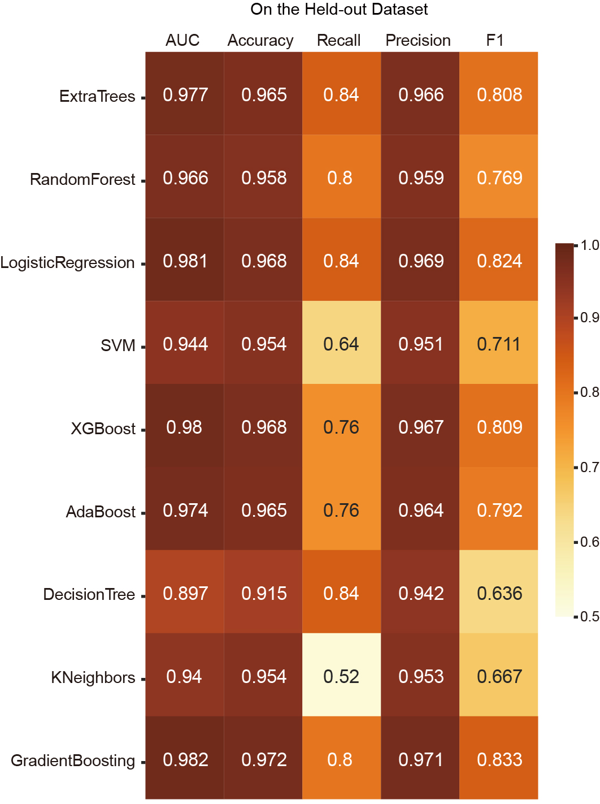
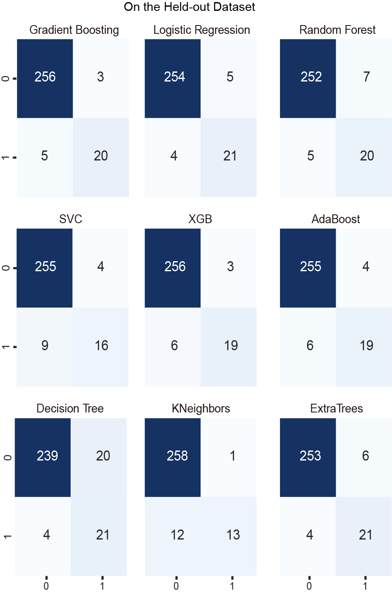
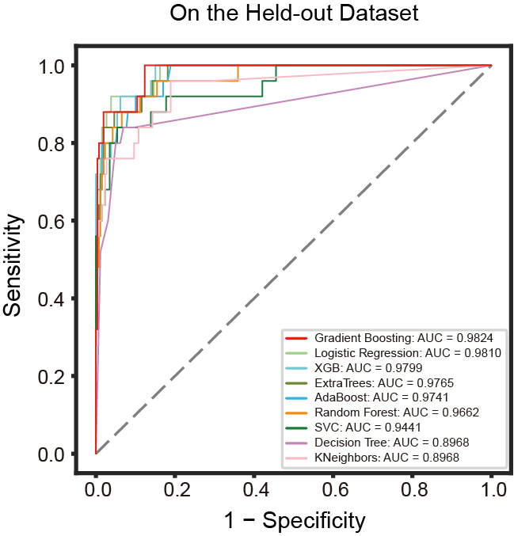
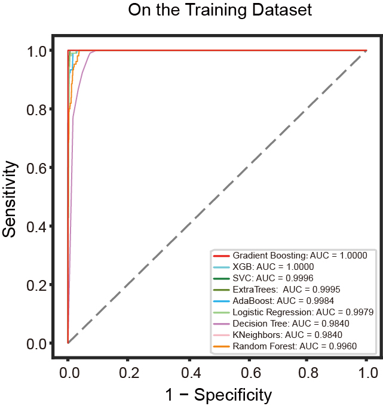
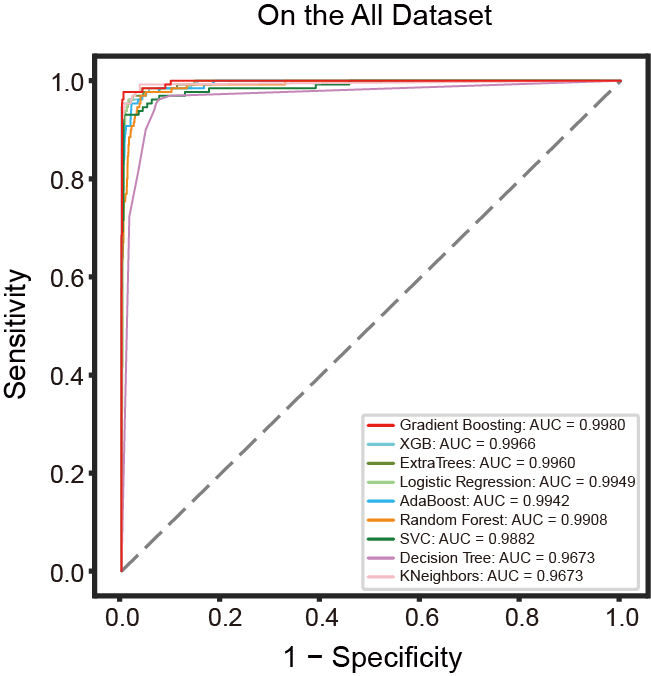
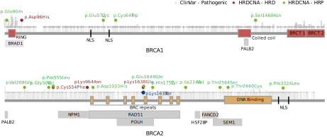

>This report is written to help readers understand what and how we did in this project. Please read the formal manuscript for more details.

# Dependencies
```{r R package, echo=TRUE, message=FALSE, warning=FALSE}
library(gbm)
library(pROC)
library(caret)
library(dplyr)
library(readxl)
library(ggpubr)
library(precrec)
library(ggplot2)
library(survival)
library(sigminer)
library(tidyverse)
library(ggBubbles)
library(survminer)
library(CINSignatureQuantification)
```
```{python Python package, echo=TRUE, eval=FALSE}
### Python code --- Unannotated defaults to R code
import numpy as np
import pandas as pd
import seaborn as sns 
import os
import matplotlib.pyplot as plt
from scipy.stats import boxcox
from matplotlib import pyplot
import matplotlib as mpl
from matplotlib.colors import LinearSegmentedColormap
from pandas import MultiIndex, Int64Index
from sklearn import metrics
from sklearn.ensemble import RandomForestClassifier, AdaBoostClassifier, GradientBoostingClassifier, ExtraTreesClassifier, VotingClassifier
from sklearn.tree import DecisionTreeClassifier
from sklearn.model_selection import GridSearchCV, cross_val_score, StratifiedKFold, learning_curve, train_test_split, cross_val_predict
from xgboost import XGBClassifier
from sklearn.metrics import fbeta_score, make_scorer, confusion_matrix, roc_curve, accuracy_score, recall_score, precision_score, roc_auc_score, f1_score, log_loss
from sklearn.metrics import classification_report
from sklearn.preprocessing import LabelEncoder
from sklearn.neighbors import KNeighborsClassifier
from sklearn.linear_model import LogisticRegression
from sklearn.naive_bayes import GaussianNB
from sklearn.svm import SVC, LinearSVC, NuSVC
from sklearn.calibration import CalibratedClassifierCV
from tqdm import tqdm
from collections import Counter
from sklearn.neural_network import MLPClassifier
from sklearn.discriminant_analysis import LinearDiscriminantAnalysis, QuadraticDiscriminantAnalysis
import seaborn as sns
from matplotlib import gridspec
import matplotlib.pyplot as plt
import matplotlib.ticker as ticker
import numpy
from pandas import Series
import joblib
import gc
```
# Homologous recombination deficiency introduction
Homologous recombination deficiency (HRD) renders cancer cells vulnerable to unrepaired double-strand breaks, and poly ADP-ribose polymerase (PARP) inhibitors and platinum chemotherapy drugs have demonstrated clinical efficacy in HRD patients. Clinically, it remains a challenge to predict HRD precisely with a fair medical price. Copy number alteration (CNA) information can be obtained from a diverse type of data, such as shallow WGS, WES, SNP array, and panel sequencing, and could represent a cost-effective type of biomarker for cancer diagnosis and clinical response prediction. Here we developed a robust HRD predictor HRD~CNA~ (Homologous recombination deficiency prediction by copy number alteration features) based on CNA features. HRD~CNA~ can precisely predict HR status across cancer types using CNA features data derived from different platforms and this study provides a robust tool for cost-effective HRD prediction and also demonstrates the applicability of CNA features in cancer precision medicine.
The following diagram shows our workflow.


Next, the different components of the work are described in detail, and all numbers and figures are generated directly from the underlying data on compilation.

# Data preprocessing
This part describes how and where the data that this project used is downloaded and preprocessed.

## Data downloading
This section describes where and how we downloaded the data.

### PCAWG dataset
Somatic copy number data for the international cancer genome consortium (ICGC) portion of PCAWG dataset was downloaded at https://dcc.icgc.org/releases/PCAWG/consensus_cnv. BRCA1/2 status annotations for this dataset are obtained from the supplementary data in [Nguyen et al](https://www.nature.com/articles/s41467-020-19406-4).

### 560 breast dataset
Somatic copy number data of the 560 breast dataset were downloaded from the department of medical genetics at the University of Cambridge (http://medgen.medschl.cam.ac.uk/serena-nik-zainal/). BRCA1/2 status annotations for this dataset are obtained from the supplementary data in [Davies et al](https://www.nature.com/articles/nm.4292).

### Panel dataset
Segment copy number variant and HR status information for the panel dataset is obtained from the supplementary data in [Wen H et al](https://bmccancer.biomedcentral.com/articles/10.1186/s12885-022-09602-4).

### 66 breast dataset
66 breast dataset are publicly available in the figshare repository provided by [de Luca et al](https://www.nature.com/articles/s41523-020-0172-0). Copy number data from ASCAT (array data) are available from https://doi.org/10.6084/m9.figshare.9808496 and ascatNGS (for original (https://doi.org/10.6084/m9.figshare.9808505) and downsampled WGS data are available from (30X: https://doi.org/10.6084/m9.figshare.9808511, 15X: https://doi.org/10.6084/m9.figshare.9808514, 10X: https://doi.org/10.6084/m9.figshare.9808517)).

### TCGA dataset
Somatic copy number data of TCGA pan-cancer dataset were downloaded from genomic data commons data portal (https://portal.gdc.cancer.gov/). Allele-specific copy number analysis of tumors was performed using ASCAT2, to generate integral allele-specific copy number profiles for the tumor cells. TCGA mutation data were downloaded by R package [TCGAbiolinks](https://github.com/BioinformaticsFMRP/TCGAbiolinks).

## Data preprocessing
This section describes how we preprocessed the data.

### Copy number profile generating
Copy number data were downloaded from databases or original articles and cleaned by hand. We carefully checked and compared all available data, extracted key info and generated tidy datasets containing absolute copy number profile with following information:

* Segment chromosome.
* Segment start.
* Segment end.
* Absolute copy number value for this segment.
* Sample ID.

```{r Copy number profile generating, echo=TRUE}
### data preparing
cn_pcawg_wgs <- readRDS("./data/cndata/cn_pcawg_wgs.rds")
cn_560_snp <- readRDS("./data/cndata/cn_560_snp.rds")
cn_60_wgs <- readRDS("./data/cndata/cn_60_wgs.rds")
cn_60_snp <- readRDS("./data/cndata/cn_60_snp.rds")
cn_60_wgs30x <- readRDS("./data/cndata/cn_60_wgs30x.rds")
cn_60_wgs15x <- readRDS("./data/cndata/cn_60_wgs15x.rds")
cn_60_wgs10x <- readRDS("./data/cndata/cn_60_wgs10x.rds")
cn_tcga_snp <- readRDS("./data/cndata/cn_tcga_snp.rds")
cn_panel <- readRDS("./data/cndata/cn_panel.rds")
cn_panel_85 <- readRDS("./data/cndata/cn_panel_85.rds")
cn_panel_416 <- readRDS("./data/cndata/cn_panel_416.rds")
```
### Sample labeling
To obtain a high-confidence training dataset of HRD, samples with BRCA1/2 deficiency were screened for classifier training. Patients annotation information were collected from in supplements data from original articles being described in the method and we carefully checked all available data and extracted key info. The selection criteria for samples are those samples with one of the following events in BRCA1/2: (i) complete copy number loss, (ii) LOH in combination with a pathogenic germline or somatic SNV/indel (as annotated in ClinVar, or a frameshift), or (iii) 2 pathogenic SNV/indels.

# Selection of the method for HRD prediction model building
This part describes how we chose the method of model development.

To find the best performance model among a multitude of methods, a total of 9 machine learning models including extremely randomized trees (Extra trees), random forest, logistic regression, support vector machine(SVM), eXtreme gradient boosting (XGB), adaptive boosting (AdaBoost), decision tree, K-nearest neighbor (KNeighbor) and gradient boosting machine (GBM) were trained with preliminary parameter adjustment, and the performances of each machine learning models are reported as the area under the receiver operating characteristic (ROC) curve (AUC) of the held-out dataset.

## Data preparing
```{python Preparing, echo=TRUE, eval=FALSE}
### Python code

mpl.rcParams['figure.figsize'] = (12, 10)

### data loading
data_train = pd.read_csv("./data/modeldata/trainall.csv")
data_test = pd.read_csv("./data/modeldata/testall.csv")

label_train = data_train.pop("type")
X = np.array(data_train)
X.shape

count = Counter(label_train)
Counter(label_train)

label_test = data_test.pop("type")
X_test = np.array(data_test)
X_test.shape

w_positive = 2*len(label_train)/count[1]
w_negative = 2*len(label_train)/count[0]
print("positive weight is %s" % str(w_positive))
print("negative weight is %s" % str(w_negative))
```
## Initial models building
```{python vs Methods, echo=TRUE, eval=FALSE}
### Python code

# vs Methods
models = list()

class_weight = {0:w_negative, 1:w_positive}

w_array = np.array([1.0] * X.shape[0])
w_array[label_train == 1] = 22.59
w_array[label_train == 0] = 2.19

models.append(LogisticRegression(random_state=20220706, class_weight=class_weight,max_iter=15000))
models.append(DecisionTreeClassifier(random_state=20220706, class_weight=class_weight,max_features=None))
models.append(RandomForestClassifier(random_state=20220706, class_weight=class_weight,max_features=None))
models.append(SVC(random_state=20220706, class_weight=class_weight))
models.append(ExtraTreesClassifier(random_state=20220706, class_weight=class_weight,max_features=None))
models.append(GradientBoostingClassifier(random_state=20220706,max_features=None))
models.append(AdaBoostClassifier(DecisionTreeClassifier(random_state=20220706, class_weight=class_weight,max_features=None)))
models.append(KNeighborsClassifier())
models.append(XGBClassifier(random_state=20220706, max_features=None))

kfold = StratifiedKFold(n_splits = 10)

pred_results = []
pred_names = []

for model in models:
    if model.__class__.__name__ not in ['GradientBoostingClassifier', 'XGBClassifier']:
        print("go:", model)
        pred_results.append(cross_val_score(model, 
                                  X, 
                                  label_train, 
                                  scoring = "roc_auc", 
                                  cv = kfold, n_jobs=15) )
        pred_names.append(model.__class__.__name__)
        print("end:", model)
    else:
        print("go:", model)
        pred_results.append(cross_val_score(model, 
                          X, 
                          y = label_train, 
                          scoring = "roc_auc", 
                          cv = kfold, n_jobs=15, fit_params={'sample_weight': w_array}))
        pred_names.append(model.__class__.__name__)
        print("end", model)
pred_means = []
pred_std = []

for pred_result in pred_results:
    pred_means.append(pred_result.mean())
    pred_std.append(pred_result.std())
    
pred_res = pd.DataFrame({"CrossValMeans":pred_means,
                         "CrossValerrors": pred_std,
                         "Algorithm":pred_names})

pred_names

```

```{python Results Showing, echo=TRUE, eval=FALSE}
### Python code

# Results Showing
pred_res.sort_values(by='CrossValMeans', ascending = False, ignore_index=True)

pred_res=pred_res.sort_values(by='CrossValMeans', ascending = False, ignore_index=True)

plt.rcParams.update({'font.family':'Arial'})
g = sns.barplot("CrossValMeans","Algorithm",
                data = pred_res,
                orient = "h"
                ,**{'xerr':pred_std},
               palette="Set3")
g.set_xlabel("10-fold Average Accuracy")
g = g.set_title("K-fold Cross validation average AUC")

```
## Parameter optimization
Select all algorithms previous trained in order to perform hyper-parameters optimization.

### Logistic regression classifier
```{python Logistic Regression, echo=TRUE, eval=FALSE}
### Python code

# Parameter optimization
gc.collect()
### logistic regression parameters tunning
LR = LogisticRegression(random_state=20220706, class_weight = class_weight, max_iter=10000000)
penalty = [ 'l2']
C = np.logspace(-2, 2)

lr_param_grid = {'penalty': penalty, 'C': C }

clf = GridSearchCV(LogisticRegression(), lr_param_grid)

gsLR = GridSearchCV(LR,param_grid = lr_param_grid, cv=10, scoring="roc_auc", n_jobs= 15, verbose = 1)

gsLR.fit(X, label_train)

LR_best = gsLR.best_estimator_

print('Best Penalty:', LR_best.get_params()['penalty'])
print('Best C:', LR_best.get_params()['C'])

### Best score
gsLR.best_score_

joblib.dump(LR_best, "./data/modeldata/allmodel/LR_best.m")
```
### SVM classifier
```{python SVM Classifier, echo=TRUE, eval=FALSE}
### Python code

### SVM Classifier
SVMC = SVC(random_state=20220706, probability=True, class_weight = class_weight)

Cs=[0.4]
gammas = [0.0001,0.001,0.002]
    
svc_param_grid = {'kernel': ['linear'], 
                  'gamma': gammas,
                  'C': Cs}

gsSVMC = GridSearchCV(SVMC,param_grid = svc_param_grid, cv=10, scoring="roc_auc", n_jobs= 15, verbose = 1)

gsSVMC.fit(X, label_train)

SVMC_best = gsSVMC.best_estimator_

print(SVMC_best.get_params())

# Best score
gsSVMC.best_score_

joblib.dump(SVMC_best, "./data/modeldata/allmodel/SVM_best.m")
```
### XGB classifier
```{python XGB Classifier, echo=TRUE, eval=FALSE}
### Python code

### XGB Classifier
XGB = XGBClassifier(use_label_encoder=False, nthread=1, random_state=20220706,max_features=None)

max_depth = [2]
min_child_weight = [7]

gamma = np.linspace(0.1,1,10, endpoint=True)\
subsample=[0.6666]

colsample_bytree=[0.83333]
XGB_param_grid = {
        'min_child_weight': min_child_weight,
        'gamma': gamma,
        'subsample': subsample,
        'colsample_bytree': colsample_bytree,
        'max_depth': max_depth
        }

gsXGB = GridSearchCV(estimator = XGB, 
                     param_grid = XGB_param_grid, 
                     cv=5, scoring="roc_auc", 
                     n_jobs= 15, verbose = 1)

gsXGB.fit(X, label_train, sample_weight = w_array)

XGB_best = gsXGB.best_estimator_
print(XGB_best.get_params())

# Best score
gsXGB.best_score_

joblib.dump(XGB_best, "./data/modeldata/allmodel/XGB_besta.m")
```
### Random forest classifier
```{python Random Forest Classifier, echo=TRUE, eval=FALSE}
### Python code

### Random Forest Classifier
RFC = RandomForestClassifier(random_state=20220706, class_weight = class_weight,max_features=None)

n_estimators=[542]
max_depth=[15]
max_depth.append(None)
min_samples_split = [ 6,7,8,9,]
min_samples_leaf = [ 8]

bootstrap = [True, False]

rf_param_grid = {"max_depth": max_depth,
              "min_samples_split": min_samples_split,
              "min_samples_leaf": min_samples_leaf,
              "bootstrap": bootstrap,
              "n_estimators" :n_estimators,
              "criterion": ["gini"]}

gsRFC = GridSearchCV(RFC,param_grid = rf_param_grid, cv=10, scoring="roc_auc", n_jobs= 15, verbose = 1)

gsRFC.fit(X, label_train)

RFC_best = gsRFC.best_estimator_
print(RFC_best.get_params())

# Best score
gsRFC.best_score_

joblib.dump(RFC_best, "./data/modeldata/allmodel/RFC_besta.m")
```
### Extra trees classifier
```{python Extra Trees Classifier, echo=TRUE, eval=FALSE}
### Python code

### Extra Trees Classifier
ETC = ExtraTreesClassifier(random_state=20220706, class_weight = class_weight,max_features=None)

n_estimators=[1160]
max_depth=[7]
max_depth.append(None)
min_samples_split = [ 1,2,3]
min_samples_leaf=[1,3,5,7,]

bootstrap = [True, False]

et_param_grid = {"max_depth": max_depth,
              "min_samples_split": min_samples_split,
              "min_samples_leaf": min_samples_leaf,
              "bootstrap": bootstrap,
              "n_estimators" :n_estimators,
              "criterion": ["gini"]}

gsETC = GridSearchCV(ETC,param_grid = et_param_grid, cv=10, scoring="roc_auc", n_jobs= 15, verbose = 1)

gsETC.fit(X, label_train)

ETC_best = gsETC.best_estimator_
print(ETC_best.get_params())

# Best score
gsETC.best_score_

joblib.dump(ETC_best, "./data/modeldata/allmodel/ETC_besta.m")
```
### K-Neighbors classifier
```{python K-Neighbors Classifier, echo=TRUE, eval=FALSE}
### Python code

### K-Neighbors Classifier
KNB = KNeighborsClassifier(algorithm='auto', leaf_size=30, p=2)

n_neighbors = [int(x) for x in np.linspace(start = 10, stop = 30, num = 10)]
weights = ['uniform', 'distance']
kn_param_grid = {"n_neighbors": n_neighbors,
                 "weights": weights}

gsKNB = GridSearchCV(KNB, param_grid = kn_param_grid, cv=10, scoring="roc_auc", n_jobs= 15, verbose = 1)

gsKNB.fit(X, label_train)

KNB_best = gsKNB.best_estimator_
print(KNB_best.get_params())

# Best score
gsKNB.best_score_

joblib.dump(KNB_best, "./data/modeldata/allmodel/KNB_best.m")

```
### Decision tree classifier
```{python Decision Tree Classifier, echo=TRUE, eval=FALSE}
### Python code

### Decision Tree Classifier
DET = DecisionTreeClassifier(random_state=20220706, class_weight=class_weight,max_features=None)

min_samples_split = [int(x) for x in np.linspace(start = 10, stop = 50, num = 5)]
max_depth = [int(x) for x in np.linspace(start = 1, stop = 20, num = 5)]
min_samples_leaf = [int(x) for x in np.linspace(start = 1, stop = 10, num = 5)]

det_param_grid = {"min_samples_split": min_samples_split,
                 "max_depth": max_depth,
                 "min_samples_leaf" :min_samples_leaf}

# Because of the large range of grid search, 5-fold CV is used to reduce the operation time.
gsDET = GridSearchCV(DET, param_grid = det_param_grid, cv=5, scoring="roc_auc", n_jobs= 15, verbose = 1)

gsDET.fit(X, label_train)

DET_best = gsDET.best_estimator_
print(DET_best.get_params())

# Best score
gsDET.best_score_

joblib.dump(DET_best, "./data/modeldata/allmodel/DET_besta.m")
```
### AdaBoost classifier
```{python AdaBoost Classifier, echo=TRUE, eval=FALSE}
### Python code

### AdaBoost Classifier
DET_best = joblib.load("./data/modeldata/allmodel/DET_besta.m")

ADA = AdaBoostClassifier(random_state=20220706)
n_estimators = [int(x) for x in np.linspace(start = 5, stop = 100, num = 50)]
learning_rate = np.linspace(start = 0.0001, stop = 2, num = 50)

ada_param_grid = {"n_estimators": n_estimators,
                  "learning_rate": learning_rate}

gsADA = GridSearchCV(ADA, param_grid = ada_param_grid, cv=5, scoring="roc_auc", n_jobs= 15, verbose = 1)

gsADA.fit(X, label_train)

ADA_best = gsADA.best_estimator_
print(ADA_best.get_params())

# Best score
gsADA.best_score_

joblib.dump(ADA_best, "./data/modeldata/allmodel/ADA_besta.m")
```
### Gradient boosting classifier
```{python Gradient Boosting Classifier, echo=TRUE, eval=FALSE}
### Python code

### Gradient Boosting Classifier
GBT = GradientBoostingClassifier(random_state=20220706,learning_rate=0.1,max_depth=3,
                                n_estimators=680, subsample=0.5,
                                 min_samples_split=2, min_samples_leaf=1,max_features=None
                                )
GBT.fit(X, label_train, sample_weight=w_array) 
y_predprob = GBT.predict_proba(X_test)[:,1]
y_predprob_train = GBT.predict_proba(X)[:,1]
print("AUC Score (Test Set) is: %f" % roc_auc_score(label_test, y_predprob))
print("AUC Score (Train Set) is: %f" % roc_auc_score(label_train, y_predprob_train))

GBT_tuning = GradientBoostingClassifier(random_state=20220706,max_features=None)

learning_rate = [0.1,0.15,0.2,0.25,0.3]
n_estimators = [int(x) for x in np.linspace(start = 600, stop = 800, num = 200)]
subsample = [0.5,0.6, 0.7, 0.75,0.8, 0.85, 0.9]
min_samples_split = [int(x) for x in np.linspace(start = 100, stop = 300, num = 100)]
max_depth = [int(x) for x in np.linspace(start = 1, stop = 8, num = 5)]
min_samples_leaf = [int(x) for x in np.linspace(start = 1, stop = 3, num = 5)]

gbt_param_grid = {"min_samples_split": min_samples_split,
                 "max_depth": max_depth,
                 "min_samples_leaf" :min_samples_leaf，
                 "learning_rate": learning_rate,
                 "n_estimators" :n_estimators,
                 "subsample": subsample}
sGBT = GridSearchCV(GBT_tuning, param_grid = gbt_param_grid, cv=5, scoring="roc_auc", n_jobs= 15, verbose = 1)

gsGBT.fit(X, label_train, sample_weight=w_array)

GBT_best = gsGBT.best_estimator_
print(GBT_best.get_params())

# Best score
gsGBT.best_score_

train_prob = GBT_best.predict_proba(X)[:,1]
test_prob = GBT_best.predict_proba(X_test)[:,1]

print("AUC Score (Test Set) is: %f" % roc_auc_score(label_test, test_prob))
print("AUC Score (Train Set) is: %f" % roc_auc_score(label_train, train_prob))

joblib.dump(GBT_best, "./data/modeldata/allmodel/GBT_best.m")
```
## Performance of models in the held-out dataset
```{python Using 5 Performance Criteria, echo=TRUE, eval=FALSE}
### Python code

# Performance of Models on the Held-out Dataset Using 5 Performance Criteria
### model loading
SVMC_best = joblib.load("./data/modeldata/allmodel/SVM_best.m")
ETC_best = joblib.load("./data/modeldata/allmodel/ETC_besta.m")
RFC_best = joblib.load("./data/modeldata/allmodel/RFC_besta.m")
XGB_best = joblib.load("./data/modeldata/allmodel/XGB_besta.m")
LR_best = joblib.load("./data/modeldata/allmodel/LR_best.m")
ADA_best = joblib.load("./data/modeldata/allmodel/ADA_besta.m")
DET_best = joblib.load("./data/modeldata/allmodel/DET_besta.m")
KNB_best = joblib.load("./data/modeldata/allmodel/KNB_best.m")
GBT_best = joblib.load("./data/modeldata/allmodel/GBT_best.m")

### using 5 performance criteria: AUC, accuracy, recall, precision, F1
accuracy_test = {"Algorithm":["ExtraTrees",
                              "RandomForest",
                              "LogisticRegression", "SVM",
                              "XGBoost", "AdaBoost", "DecisionTree",
                              "KNeighbors", "GradientBoosting"],
                 "AUC":[roc_auc_score(label_test, ETC_best.predict_proba(X_test)[:,1]),
                        roc_auc_score(label_test, RFC_best.predict_proba(X_test)[:,1]),
                        roc_auc_score(label_test, LR_best.predict_proba(X_test)[:,1]),
                        roc_auc_score(label_test, SVMC_best.predict_proba(X_test)[:,1]),
                        roc_auc_score(label_test, XGB_best.predict_proba(X_test)[:,1]),
                        roc_auc_score(label_test, ADA_best.predict_proba(X_test)[:,1]),
                        roc_auc_score(label_test, DET_best.predict_proba(X_test)[:,1]),
                        roc_auc_score(label_test, KNB_best.predict_proba(X_test)[:,1]),
                        roc_auc_score(label_test, GBT_best.predict_proba(X_test)[:,1]),
                         ],
                 "Accuracy":[accuracy_score(label_test, ETC_best.predict(X_test)),
                             accuracy_score(label_test, RFC_best.predict(X_test)),
                             accuracy_score(label_test, LR_best.predict(X_test)),
                             accuracy_score(label_test, SVMC_best.predict(X_test)),
                             accuracy_score(label_test, XGB_best.predict(X_test)),
                             accuracy_score(label_test, ADA_best.predict(X_test)),
                             accuracy_score(label_test, DET_best.predict(X_test)),
                             accuracy_score(label_test, KNB_best.predict(X_test)),
                             accuracy_score(label_test, GBT_best.predict(X_test)),
                            ],
                "Precision":[precision_score(label_test, ETC_best.predict(X_test),average='weighted'),
                             precision_score(label_test, RFC_best.predict(X_test),average='weighted'),
                             precision_score(label_test, LR_best.predict(X_test),average='weighted'),
                             precision_score(label_test, SVMC_best.predict(X_test),average='weighted'),
                             precision_score(label_test, XGB_best.predict(X_test),average='weighted'),
                             precision_score(label_test, ADA_best.predict(X_test),average='weighted'),
                             precision_score(label_test, DET_best.predict(X_test),average='weighted'),
                             precision_score(label_test, KNB_best.predict(X_test),average='weighted'),
                             precision_score(label_test, GBT_best.predict(X_test),average='weighted'),
                             ],
                 "Recall":[recall_score(label_test, ETC_best.predict(X_test)),
                           recall_score(label_test, RFC_best.predict(X_test)),
                           recall_score(label_test, LR_best.predict(X_test)),
                           recall_score(label_test, SVMC_best.predict(X_test)),
                           recall_score(label_test, XGB_best.predict(X_test)),
                           recall_score(label_test, ADA_best.predict(X_test)),
                           recall_score(label_test, DET_best.predict(X_test)),
                           recall_score(label_test, KNB_best.predict(X_test)),
                           recall_score(label_test, GBT_best.predict(X_test)),
                          ],
                 "F1":[f1_score(label_test, ETC_best.predict(X_test)),
                       f1_score(label_test, RFC_best.predict(X_test)),
                       f1_score(label_test, LR_best.predict(X_test)),
                       f1_score(label_test, SVMC_best.predict(X_test)),
                       f1_score(label_test, XGB_best.predict(X_test)),
                       f1_score(label_test, ADA_best.predict(X_test)),
                       f1_score(label_test, DET_best.predict(X_test)),
                       f1_score(label_test, KNB_best.predict(X_test)),
                       f1_score(label_test, GBT_best.predict(X_test)),
                 ]
                }

accuracy_test = pd.DataFrame(accuracy_test)
accuracy_test.index = accuracy_test["Algorithm"]
accuracy_test.pop("Algorithm")


fig = plt.figure(figsize=(13,20))

mpl.rcParams['pdf.fonttype'] = 42
mpl.rcParams['ps.fonttype'] = 42

g = sns.heatmap(accuracy_test, annot = True, fmt = ".3g",cbar=True,vmin=0.5,vmax=1,annot_kws = {'fontsize':18},
                cbar_kws={"shrink": 0.5},
                cmap="YlOrBr",
                yticklabels='auto')
g.xaxis.tick_top()
g.yaxis.label.set_visible(False)
g.set_yticklabels(g.get_yticklabels(),rotation=360)
plt.xticks(fontsize=20)
plt.yticks(fontsize=20)
plt.savefig("ML_method_result_ai.pdf", dpi = 700,bbox_inches='tight')
```
```{r echo=FALSE, fig.height=8, fig.width=5}

```

```{python Confusion Matrix, echo=TRUE, eval=FALSE}
### Python code

### confusion matrix
la=np.array(label_test)

fig = plt.figure(figsize=(12,16))
mpl.rcParams['pdf.fonttype'] = 42
mpl.rcParams['ps.fonttype'] = 42
gs = gridspec.GridSpec(3, 3)

ax11 = plt.subplot(gs[0])
gbtcm=confusion_matrix(la,GBT_best.predict(X_test))
sns.heatmap(gbtcm,fmt='.20g',cmap='Blues',annot=True,cbar=False,annot_kws = {'size':18},xticklabels=False)
plt.title('Gradient Boosting Classifier')

ax12 = plt.subplot(gs[2])
rfccm=confusion_matrix(la,RFC_best.predict(X_test))
sns.heatmap(rfccm,fmt='g',cmap='Blues',annot=True,cbar=False,annot_kws = {'size':18},xticklabels=False,yticklabels=False)
plt.title('Random Forest Classifier')

ax13 = plt.subplot(gs[1])
lrcm=confusion_matrix(la,LR_best.predict(X_test))
sns.heatmap(lrcm,fmt='g',cmap='Blues',annot=True,cbar=False,annot_kws = {'size':18},xticklabels=False,yticklabels=False)
plt.title('Logistic Regression')

ax21 = plt.subplot(gs[3])
svcm=confusion_matrix(la,SVMC_best.predict(X_test))
sns.heatmap(svcm,fmt='g',cmap='Blues',annot=True,cbar=False,annot_kws = {'size':18},xticklabels=False)
plt.title('SVM')

ax22 = plt.subplot(gs[4])
xgbcm=confusion_matrix(la,XGB_best.predict(X_test))
sns.heatmap(xgbcm,fmt='g',cmap='Blues',annot=True,cbar=False,annot_kws = {'size':18},xticklabels=False,yticklabels=False)
plt.title('XGB Classifier')

ax23 = plt.subplot(gs[5])
adacm=confusion_matrix(la,ADA_best.predict(X_test))
sns.heatmap(adacm,fmt='g',cmap='Blues',annot=True,cbar=False,annot_kws = {'size':18},xticklabels=False,yticklabels=False)
plt.title('AdaBoost Classifier')

ax31 = plt.subplot(gs[6])
detcm=confusion_matrix(la,DET_best.predict(X_test))
sns.heatmap(detcm,fmt='g',cmap='Blues',annot=True,cbar=False,annot_kws = {'size':18})
plt.title('Decision Tree Classifier')

ax32 = plt.subplot(gs[7])
knbcm=confusion_matrix(la,KNB_best.predict(X_test))
sns.heatmap(knbcm,fmt='g',cmap='Blues',annot=True,cbar=False,annot_kws = {'size':18},yticklabels=False)
plt.title('KNeighbors Classifier')

ax33 = plt.subplot(gs[8])
etccm=confusion_matrix(la,ETC_best.predict(X_test))
sns.heatmap(etccm,fmt='g',cmap='Blues',annot=True,cbar=False,annot_kws = {'size':18},yticklabels=False)
plt.title('ExtraTrees Classifier')

plt.savefig("./fig/vsmethod/cm.pdf", dpi=300,bbox_inches='tight')
```
```{r echo=FALSE, fig.height=8, fig.width=5}

```

```{python ROC on Held-out Dataset, echo=TRUE, eval=FALSE}
### Python code

### ROC on held-out dataset
la=np.array(label_test)

etc_auc = roc_auc_score(label_test, ETC_best.predict_proba(X_test)[:,1])
rfc_auc =roc_auc_score(label_test, RFC_best.predict_proba(X_test)[:,1])
lrc_auc =roc_auc_score(label_test, LR_best.predict_proba(X_test)[:,1])
svmc_auc =roc_auc_score(label_test, SVMC_best.predict_proba(X_test)[:,1])
xgb_auc =roc_auc_score(label_test, XGB_best.predict_proba(X_test)[:,1])
ada_auc =roc_auc_score(label_test, ADA_best.predict_proba(X_test)[:,1])
det_auc =roc_auc_score(label_test, DET_best.predict_proba(X_test)[:,1])
knb_auc =roc_auc_score(label_test, KNB_best.predict_proba(X_test)[:,1])
gbt_auc =roc_auc_score(label_test, GBT_best.predict_proba(X_test)[:,1])

plt.rc('font',family='Arial')
plt.figure(figsize=(10,10))
mpl.rcParams['pdf.fonttype'] = 42
mpl.rcParams['ps.fonttype'] = 42
lw=1.5

gbtfpr,gbttpr,gbtthresholds = metrics.roc_curve(la,GBT_best.predict_proba(X_test)[:,1])

plt.plot(gbtfpr,gbttpr,color='red',lw=lw,label='Gradient Boosting Classifier AUC= %0.4f' % gbt_auc)

lrcfpr,lrctpr,lrcthresholds = metrics.roc_curve(la,LR_best.predict_proba(X_test)[:,1])
plt.plot(lrcfpr,lrctpr,color='palegreen',lw=lw,label='Logistic Regression AUC= %0.4f' % lrc_auc)

xgbfpr,xgbtpr,xgbthresholds = metrics.roc_curve(la,XGB_best.predict_proba(X_test)[:,1])
plt.plot(xgbfpr,xgbtpr,color='cyan',lw=lw,label='XGB Classifier AUC= %0.4f' % xgb_auc)

etcfpr,etctpr,etcthresholds = metrics.roc_curve(la,ETC_best.predict_proba(X_test)[:,1])
plt.plot(etcfpr,etctpr,color='olivedrab',lw=lw,label='ExtraTrees Classifier AUC= %0.4f' % etc_auc)

adafpr,adatpr,adathresholds = metrics.roc_curve(la,ADA_best.predict_proba(X_test)[:,1])
plt.plot(adafpr,adatpr,color='deepskyblue',lw=lw,label='AdaBoost Classifier AUC= %0.4f' % ada_auc)

rfcfpr,rfctpr,rfcthresholds = metrics.roc_curve(la,RFC_best.predict_proba(X_test)[:,1])
plt.plot(rfcfpr,rfctpr,color='darkorange',lw=lw,label='Random Forest Classifier AUC= %0.4f' % rfc_auc)

svmcfpr,svmctpr,svmcthresholds = metrics.roc_curve(la,SVMC_best.predict_proba(X_test)[:,1])
plt.plot(svmcfpr,svmctpr,color='green',lw=lw,label='SVM AUC= %0.4f' % svmc_auc)

rfcfpr,rfctpr,rfcthresholds = metrics.roc_curve(la,DET_best.predict_proba(X_test)[:,1])
plt.plot(rfcfpr,rfctpr,color='violet',lw=lw,label='Decision Tree Classifier AUC= %0.4f' % det_auc)

detfpr,dettpr,detthresholds = metrics.roc_curve(la,KNB_best.predict_proba(X_test)[:,1])
plt.plot(detfpr,dettpr,color='pink',lw=lw,label='KNeighbors Classifier AUC= %0.4f' % det_auc)

plt.plot([0,1],[0,1],color='gray',lw=lw,linestyle='--')
plt.xlabel('False Positive Rate',fontsize=16)
plt.ylabel('True Positive Rate',fontsize=16)
plt.title('ROC of different models on held-out dataset',fontsize=16)

plt.legend(loc="lower right",fontsize=13)

plt.savefig("./fig/vsmethod/testAUC_y.pdf", dpi=300,bbox_inches='tight')

accuracy_test.sort_values(by="AUC", ascending=False)
```
```{r echo=FALSE, fig.height=5, fig.width=5}

```

```{python ROC on Training Dataset, echo=TRUE, eval=FALSE}
### Python code

### ROC on training dataset
la=np.array(label_train)

etc_auc = roc_auc_score(label_train, ETC_best.predict_proba(X)[:,1])
rfc_auc =roc_auc_score(label_train, RFC_best.predict_proba(X)[:,1])
lrc_auc =roc_auc_score(label_train, LR_best.predict_proba(X)[:,1])
svmc_auc =roc_auc_score(label_train, SVMC_best.predict_proba(X)[:,1])
xgb_auc =roc_auc_score(label_train, XGB_best.predict_proba(X)[:,1])
ada_auc =roc_auc_score(label_train, ADA_best.predict_proba(X)[:,1])
det_auc =roc_auc_score(label_train, DET_best.predict_proba(X)[:,1])
knb_auc =roc_auc_score(label_train, KNB_best.predict_proba(X)[:,1])
gbt_auc =roc_auc_score(label_train, GBT_best.predict_proba(X)[:,1])

plt.rc('font',family='Arial')
plt.figure(figsize=(10,10))
mpl.rcParams['pdf.fonttype'] = 42
mpl.rcParams['ps.fonttype'] = 42
lw=1.5

gbtfpr,gbttpr,gbtthresholds = metrics.roc_curve(la,GBT_best.predict_proba(X)[:,1])
plt.plot(gbtfpr,gbttpr,color='red',lw=lw,label='Gradient Boosting Classifier AUC= %0.4f' % gbt_auc)

xgbfpr,xgbtpr,xgbthresholds = metrics.roc_curve(la,XGB_best.predict_proba(X)[:,1])
plt.plot(xgbfpr,xgbtpr,color='cyan',lw=lw,label='XGB Classifier AUC= %0.4f' % xgb_auc)

svmcfpr,svmctpr,svmcthresholds = metrics.roc_curve(la,SVMC_best.predict_proba(X)[:,1])
plt.plot(svmcfpr,svmctpr,color='green',lw=lw,label='SVM AUC= %0.4f' % svmc_auc)

etcfpr,etctpr,etcthresholds = metrics.roc_curve(la,ETC_best.predict_proba(X)[:,1])
plt.plot(etcfpr,etctpr,color='olivedrab',lw=lw,label='ExtraTrees Classifier AUC= %0.4f' % etc_auc)

adafpr,adatpr,adathresholds = metrics.roc_curve(la,ADA_best.predict_proba(X)[:,1])
plt.plot(adafpr,adatpr,color='deepskyblue',lw=lw,label='AdaBoost Classifier AUC= %0.4f' % ada_auc)

lrcfpr,lrctpr,lrcthresholds = metrics.roc_curve(la,LR_best.predict_proba(X)[:,1])
plt.plot(lrcfpr,lrctpr,color='palegreen',lw=lw,label='Logistic Regression AUC= %0.4f' % lrc_auc)

rfcfpr,rfctpr,rfcthresholds = metrics.roc_curve(la,DET_best.predict_proba(X)[:,1])
plt.plot(rfcfpr,rfctpr,color='violet',lw=lw,label='Decision Tree Classifier AUC= %0.4f' % det_auc)

detfpr,dettpr,detthresholds = metrics.roc_curve(la,KNB_best.predict_proba(X)[:,1])
plt.plot(detfpr,dettpr,color='pink',lw=lw,label='KNeighbors Classifier AUC= %0.4f' % det_auc)

rfcfpr,rfctpr,rfcthresholds = metrics.roc_curve(la,RFC_best.predict_proba(X)[:,1])
plt.plot(rfcfpr,rfctpr,color='darkorange',lw=lw,label='Random Forest Classifier AUC= %0.4f' % rfc_auc)


plt.plot([0,1],[0,1],color='gray',lw=lw,linestyle='--')
plt.xlabel('False Positive Rate',fontsize=16)
plt.ylabel('True Positive Rate',fontsize=16)
plt.title('ROC of different models on training dataset',fontsize=16)

plt.legend(loc="lower right",fontsize=13)

plt.savefig("./fig/vsmethod/trainAUC_y.pdf", dpi=300,bbox_inches='tight')
```
```{r echo=FALSE, fig.height=5, fig.width=5}

```

```{python ROC on All Dataset, echo=TRUE, eval=FALSE}
### Python code

### ROC on all dataset
d1 = pd.read_csv("./data/modeldata/trainall.csv")
d2 = pd.read_csv("./data/modeldata/testall.csv")

frames=[d1,d2]
alldata= pd.concat(frames)
label_all = alldata.pop("type")
alldata = np.array(alldata)

la=np.array(label_all)

etc_auc = roc_auc_score(label_all, ETC_best.predict_proba(alldata)[:,1])
rfc_auc =roc_auc_score(label_all, RFC_best.predict_proba(alldata)[:,1])
lrc_auc =roc_auc_score(label_all, LR_best.predict_proba(alldata)[:,1])
svmc_auc =roc_auc_score(label_all, SVMC_best.predict_proba(alldata)[:,1])
xgb_auc =roc_auc_score(label_all, XGB_best.predict_proba(alldata)[:,1])
ada_auc =roc_auc_score(label_all, ADA_best.predict_proba(alldata)[:,1])
det_auc =roc_auc_score(label_all, DET_best.predict_proba(alldata)[:,1])
knb_auc =roc_auc_score(label_all, KNB_best.predict_proba(alldata)[:,1])
gbt_auc =roc_auc_score(label_all, GBT_best.predict_proba(alldata)[:,1])

plt.figure(figsize=(10,10))
mpl.rcParams['pdf.fonttype'] = 42
mpl.rcParams['ps.fonttype'] = 42
lw=1.5

gbtfpr,gbttpr,gbtthresholds = metrics.roc_curve(la,GBT_best.predict_proba(alldata)[:,1])
plt.plot(gbtfpr,gbttpr,color='red',lw=lw,label='Gradient Boosting Classifier AUC= %0.4f' % gbt_auc)

xgbfpr,xgbtpr,xgbthresholds = metrics.roc_curve(la,XGB_best.predict_proba(alldata)[:,1])
plt.plot(xgbfpr,xgbtpr,color='cyan',lw=lw,label='XGB Classifier AUC= %0.4f' % xgb_auc)

etcfpr,etctpr,etcthresholds = metrics.roc_curve(la,ETC_best.predict_proba(alldata)[:,1])
plt.plot(etcfpr,etctpr,color='olivedrab',lw=lw,label='ExtraTrees Classifier AUC= %0.4f' % etc_auc)

lrcfpr,lrctpr,lrcthresholds = metrics.roc_curve(la,LR_best.predict_proba(alldata)[:,1])
plt.plot(lrcfpr,lrctpr,color='palegreen',lw=lw,label='Logistic Regression AUC= %0.4f' % lrc_auc)

adafpr,adatpr,adathresholds = metrics.roc_curve(la,ADA_best.predict_proba(alldata)[:,1])
plt.plot(adafpr,adatpr,color='deepskyblue',lw=lw,label='AdaBoost Classifier AUC= %0.4f' % ada_auc)

rfcfpr,rfctpr,rfcthresholds = metrics.roc_curve(la,RFC_best.predict_proba(alldata)[:,1])
plt.plot(rfcfpr,rfctpr,color='darkorange',lw=lw,label='Random Forest Classifier AUC= %0.4f' % rfc_auc)

svmcfpr,svmctpr,svmcthresholds = metrics.roc_curve(la,SVMC_best.predict_proba(alldata)[:,1])
plt.plot(svmcfpr,svmctpr,color='green',lw=lw,label='SVM AUC= %0.4f' % svmc_auc)

rfcfpr,rfctpr,rfcthresholds = metrics.roc_curve(la,DET_best.predict_proba(alldata)[:,1])
plt.plot(rfcfpr,rfctpr,color='violet',lw=lw,label='Decision Tree Classifier AUC= %0.4f' % det_auc)

detfpr,dettpr,detthresholds = metrics.roc_curve(la,KNB_best.predict_proba(alldata)[:,1])
plt.plot(detfpr,dettpr,color='pink',lw=lw,label='KNeighbors Classifier AUC= %0.4f' % det_auc)

plt.plot([0,1],[0,1],color='gray',lw=lw,linestyle='--')
plt.xlabel('False Positive Rate',fontsize=16)
plt.ylabel('True Positive Rate',fontsize=16)
plt.title('ROC of different models on all dataset',fontsize=16)

plt.legend(loc="lower right",fontsize=13)

plt.savefig("./fig/vsmethod/allAUC_model.pdf", dpi=300,bbox_inches='tight')
```
```{r echo=FALSE, fig.height=5, fig.width=5}

```

The AUC of the held-out dataset was selected as the performance criterion, and the GBM model has the best performance on the training dataset. Accordingly, subsequent HRD prediction model was developed by the GBM method, which is a machine learning technique based on decision trees.

# Pan-cancer HRD predictor development
This part describes how we developed the model.

Gradient boosting is a machine learning technique for regression and classification problems, which produces a prediction model in the form of an ensemble of weak prediction models. R package [gbm](https://github.com/gbm-developers/gbm) was used to implementation of the GBM.
We compared the performance of three series of models using CNA features or using the reported two sets of CNA signatures (Sig-CNS or Sig-CX).

## Comparison of CNA features, Sig-CNS and Sig-CX
Three types of models were built using CNA features directly or using two CNA signatures, Sig-CNS and Sig-CX, each of which was modeled repeatedly using Monte Carlo cross-validation (CV) which was repeated 100 times on the training dataset.

### Model built with CNA features
#### Calling CNA features
8 fundamental CNA features were computed, including the breakpoint count per 10 Mb (named BP10MB); the breakpoint count per chromosome arm (named BPArm); the copy number of the segments (named CN); the difference in copy number between adjacent segments (named CNCP); the lengths of oscillating copy number segment chains (named OsCN); the log10 based size of segments (named SS); the minimal number of chromosome with 50% copy number variation (named NC50); the burden of chromosome (named BoChr). Then classified 8 CNA feature distributions into 80 different components.
Calling CNA features was performed using R package [Sigminer](https://github.com/ShixiangWang/sigminer).
```{r Calling CNA Features, echo=TRUE, eval=FALSE}
# Calling CNA Features
### PCAWG dataset
callpcawg <- read_copynumber(cn_pcawg_wgs,
                             seg_cols = c("chromosome", "start", "end", "segVal"),
                             genome_build = "hg19", complement = FALSE, verbose = TRUE)
tally_W_pcawg <- sig_tally(callpcawg, method = "W")

# saveRDS(tally_W_pcawg, file = "./data/tallydata/tally_W_pcawg.rds")

### 560 breast dataset
call560 <- read_copynumber(cn_560_snp,
                           seg_cols = c("chromosome", "start", "end", "segVal"),
                           genome_build = "hg19", complement = FALSE, verbose = TRUE)
tally_W_560 <- sig_tally(call560, method = "W")

# saveRDS(tally_W_560, file = "./data/tallydata/snp560/tally_W_560.rds")
```
#### Model building
CNA features are used to build models and save the resulting AUC and PR-AUC.
```{r Model building using CNA Features, echo=TRUE, eval=FALSE}
### data preparing
tally_W_pcawg <- readRDS("./data/tallydata/tally_W_pcawg.rds")
tally_W_560 <- readRDS("./data/tallydata/tally_W_560.rds")
pcawg_hrr <- readRDS("./data/typedata/pcawg_hrr.rds") # 1106
pcawg_hrd <- readRDS("./data/typedata/pcawg_hrd.rds") # 53
a560_hrr <- readRDS("./data/typedata/a560_hrr.rds") # 234
a560_hrd <- readRDS("./data/typedata/a560_hrd.rds") # 77

#### pcawg_wgs 1159 = 1106 + 53
nmfpcawg <- tally_W_pcawg$nmf_matrix
nmfpcawg <- as.data.frame(nmfpcawg)
nmfpcawg$sample <- rownames(nmfpcawg)
rownames(nmfpcawg) <- NULL

nmfpcawg$type <- ifelse(nmfpcawg$sample %in% pcawg_hrd$sample, "1",
                        ifelse(nmfpcawg$sample %in% pcawg_hrr$sample, "0", "null"))
nmfpcawg <- nmfpcawg %>% filter(type != "null")

#### 560_snp 311 = 234 + 77
nmf560 <- tally_W_560$nmf_matrix
nmf560 <- as.data.frame(nmf560)
nmf560$sample <- rownames(nmf560)
rownames(nmf560) <- NULL

nmf560$type <- ifelse(nmf560$sample %in% a560_hrr$Sample, "0",
                      ifelse(nmf560$sample %in% a560_hrd$Sample, "1", "null"))
nmf560 <- nmf560 %>% filter(type != "null")

#### all data 1470 = 1340 + 130
alldata <- rbind(nmfpcawg, nmf560)
rownames(alldata) <- alldata$sample
alldata <- alldata[ , -81]
alldata$type <- as.numeric(alldata$type)

# saveRDS(alldata, file = "./data/modeldata/alldata.rds")

set.seed(123) # for reproducibility
ind = sample(2, nrow(alldata), replace = T, prob = c(0.8, 0.2))

trainall = alldata[ind == 1, ] # #the training dataset 1186 = 1081 + 105
testall = alldata[ind == 2, ] # #the test dataset 284 = 259 + 25

t <- table(trainall$type)
t[2]/t[1]
#         1
# 0.09713228
t <- table(testall$type)
t[2]/t[1]
#         1
# 0.0965251

# saveRDS(trainall, file = "./data/modeldata/trainall.rds")
# saveRDS(testall, file = "./data/modeldata/testall.rds")

# write.table(alldata, file = "./data/modeldata/alldata.csv", sep = ",", row.names = F, quote = F)
# write.table(trainall, file = "./data/modeldata/trainall.csv", sep = ",", row.names = F, quote = F)
# write.table(testall, file = "./data/modeldata/testall.csv", sep = ",", row.names = F, quote = F)


### model building
clus <- makeCluster(20)

Run <- function(x){
  
  library(tidyverse)
  library(sigminer)
  library(pROC)
  library(gbm)
  library(precrec)
  library(dplyr)
  
  trainall <- readRDS("./data/modeldata/trainall.rds")
  testall <- readRDS("./data/modeldata/testall.rds")
  alldata <- readRDS("./data/modeldata/alldata.rds")
  
  set.seed(x)
  churn.gbmtest = gbm(formula = type~., distribution = "bernoulli", data = trainall,
                      n.trees = 6000, 
                      interaction.depth = 7,
                      shrinkage = 0.01,
                      cv.folds = 5,
                      bag.fraction = 0.8,
                      n.minobsinnode = 5)
  bestTree <- gbm.perf(churn.gbmtest, plot.it = T, 
                       oobag.curve = FALSE, 
                       overlay = TRUE, 
                       method = "cv")
  
  set.seed(3)
  churn.gbmtest2 = gbm(formula = type~., distribution = "bernoulli",
                       data = trainall,
                       n.trees = bestTree,
                       interaction.depth = 7,
                       shrinkage = 0.01,
                       cv.folds = 5,
                       bag.fraction = 0.8,
                       n.minobsinnode = 3)
  
  rel_infs <- relative.influence(churn.gbmtest2, n.trees = bestTree)
  
  
  featuresall <- gsub("\\`", "", names(rel_infs)[rel_infs/sum(rel_infs) > 0.01])
  
  choosedata = trainall[ , c(featuresall, "type")]
  
  set.seed(2)
  churn.gbmtest3 = gbm(formula = type~., distribution = "bernoulli",
                       data = choosedata,
                       n.trees = bestTree,
                       interaction.depth = 7,
                       shrinkage = 0.01,
                       cv.folds = 5,
                       bag.fraction = 0.8,
                       n.minobsinnode = 3)
  
  set.seed(1)
  churn.gbmtest4 = gbm(formula = type~., distribution = "bernoulli",
                       data = choosedata,
                       n.trees = bestTree,
                       interaction.depth = 7,
                       shrinkage = 0.01,
                       bag.fraction = 0.8,
                       n.minobsinnode = 3)
  
  
  churntrain = predict(churn.gbmtest4, trainall, n.trees = bestTree, type = "response")
  
  churnall = predict(churn.gbmtest4, alldata, n.trees = bestTree, type = "response")
  
  churntest = predict(churn.gbmtest4, testall, n.trees = bestTree,type = "response")
  
  
  trainscore <- data.frame(sampletype = trainall$type, probablity = churntrain,
                           sampleid = rownames(trainall), datatype = "Training dataset")
  
  testscore <- data.frame(sampletype = testall$type, probablity = churntest,
                          sampleid = rownames(testall), datatype = "Testing dataset")
  
  alldatascore <- data.frame(sampletype = alldata$type, probablity = churnall,
                             sampleid = rownames(alldata), datatype = "All dataset")
  
  
  pre_obj1 <- mmdata(trainscore$probablity, trainscore$sampletype)
  pre_obj1 <- evalmod(pre_obj1)
  auctrain <- auc(pre_obj1)
  
  pre_obj2 <- mmdata(testscore$probablity, testscore$sampletype)
  pre_obj2 <- evalmod(pre_obj2)
  auctest <- auc(pre_obj2)
  
  pre_obj3 <- mmdata(alldatascore$probablity, alldatascore$sampletype)
  pre_obj3 <- evalmod(pre_obj3)
  aucall <- auc(pre_obj3)
  
  
  model_selection <- data.frame(ROC = c(round(auctrain$aucs[1],4), round(auctest$aucs[1],4), round(aucall$aucs[1],4)),
                                PRC = c(round(auctrain$aucs[2],4), round(auctest$aucs[2],4), round(aucall$aucs[1],4)),
                                dataset = c("traindata","testdata","alldata"))
  
  write.table(model_selection, file="./data/modelselection/model_selection_feature.txt", append=T, row.names = F)

}

nums <- 1:100

parLapply(clus, nums ,fun = Run)
```
### Model built with Sig-CNS
#### Analysis of mutational signatures
Identification of Sig-CNS used R package [Sigminer](https://github.com/AlexandrovLab/SigProfilerExtractor), which is based on the tool [SigProfiler](https://github.com/AlexandrovLab/SigProfilerExtractor) caller. 

PBS file `sig_all.pbs` content:
```{bash sig_all.pbs, echo=TRUE, eval=FALSE}
#!/bin/sh
#PBS -N sig_all
#PBS -k oe
#PBS -l walltime=1000:00:00,nodes=1:ppn=20
#PBS -q slst_fat

cd /public/home/yaohz/project/HRD/data
source activate r-cna
conda info -e 
Rscript call_all_sp.R

```

R script `call_all_sp.R` content:
```{r call_all_sp.R, echo=TRUE, eval=FALSE}
library(sigminer)

nmfall <- readRDS("/public/home/yaohz/project/HRD/data/nmfall.rds")

sigprofiler_extract(nmfall,
                    output = "/public/home/yaohz/project/HRD/data/sig_all",
                    range = 2:30,
                    nrun = 100,
                    init_method = "random",
                    is_exome = FALSE,
                    use_conda = F
)
```
#### Signature number determination
First, load the results.
```{r load the result, echo=TRUE, eval=FALSE}
sig_all <- sigprofiler_import("./data/modelselection/sig_CNS/sig_all/", order_by_expo = TRUE, type = "all")

# saveRDS(sig_all, file = "./data/modelselection/data/all_cn_solutions_sp.rds")
```

Then we visualize the signature number survey.
```{r visualize the signature number survey, echo=TRUE, fig.height=4, fig.width=9}
sig_all <- readRDS("./data/modelselection/data/all_cn_solutions_sp.rds")

show_sig_number_survey(
  sig_all$all_stats %>%
    dplyr::rename(
      s = `Stability (Avg Silhouette)`,
      e = `Mean Cosine Distance`
    ) %>%
    dplyr::mutate(
      SignatureNumber = as.integer(gsub("[^0-9]", "", SignatureNumber))
    ),
  x = "SignatureNumber",
  left_y = "s", right_y = "e",
  left_name = "Stability (Avg Silhouette)",
  right_name = "Mean Cosine Distance",
  highlight = 8
)
```

We picked up 8 signatures for our dataset due to its relatively high stability and low distance.
```{r Signature number determination, echo=TRUE, eval=FALSE}
all_sigs <- sig_all$solution_list$S8
apply(all_sigs$Exposure, 1, mean)

sig_names(all_sigs)

colnames(all_sigs$Signature) <- colnames(all_sigs$Signature.norm) <- rownames(all_sigs$Exposure) 
rownames(all_sigs$Exposure.norm) <- all_sigs$Stats$signatures$Signatures <- paste0("CNS", 1:8)

sig_names(all_sigs)

saveRDS(all_sigs, file = "./data/modelselection/data/all_cn_sigs_8_signature.rds")
```
#### Model building
Sig-CNS are used to build models and save the resulting AUC and PR-AUC.
```{r Model building using Sig-CNS, echo=TRUE, eval=FALSE}
### data preparing
all_cn_sigs_8_signature <- readRDS("./data/modelselection/data/all_cn_sigs_8_signature.rds")
pcawghrd <- readRDS("./data/typedata/pcawg_hrd.rds")
pcawghrr <- readRDS("./data/typedata/pcawg_hrr.rds")
a560hrd <- readRDS("./data/typedata/a560_hrd.rds")
a560hrr <- readRDS("./data/typedata/a560_hrr.rds")

#### all data 1470
alldata <- t(all_cn_sigs_8_signature$Exposure)
alldata <- as.data.frame(alldata)

alldata$type <- ifelse(rownames(alldata) %in% pcawghrd$sample, "1",
                       ifelse(rownames(alldata) %in% pcawghrr$sample, "0",
                              ifelse(rownames(alldata) %in% a560hrd$Sample, "1",
                                     ifelse(rownames(alldata) %in% a560hrr$Sample, "0", "null"))))
alldata <- alldata %>% filter(type != "null")

# saveRDS(alldata, file = "./data/modelselection/modelcnsdata/alldata.rds")

set.seed(1234) # for reproducibility
ind = sample(2, nrow(alldata), replace = T, prob = c(0.8, 0.2))

trainall = alldata[ind == 1, ] # #the training dataset 1174
testall = alldata[ind == 2, ] # #the test dataset 296

t <- table(trainall$type)
t[2]/t[1]
# 1
# 0.0961718
t <- table(testall$type)
t[2]/t[1]
# 1
# 0.1003717

saveRDS(trainall, file = "./data/modelselection/modelcnsdata/trainall.rds")
saveRDS(testall, file = "./data/modelselection/modelcnsdata/testall.rds")

### model building
clus <- makeCluster(20)

Run <- function(x){
  
  library(tidyverse)
  library(sigminer)
  library(pROC)
  library(gbm)
  library(precrec)
  library(dplyr)
  
  trainall <- readRDS("./data/modelselection/modelcnsdata/trainall.rds")
  testall <- readRDS("./data/modelselection/modelcnsdata/testall.rds")
  alldata <- readRDS("./data/modelselection/modelcnsdata/alldata.rds")
  
  set.seed(x) # for reproducibility
  churn.gbmtest = gbm(formula = type~., distribution = "bernoulli", data = trainall,
                      n.trees = 6000, 
                      interaction.depth = 7,
                      shrinkage = 0.01,
                      cv.folds = 5,
                      bag.fraction = 0.8,
                      n.minobsinnode = 5)
  bestTree <- gbm.perf(churn.gbmtest, plot.it = T, 
                       oobag.curve = FALSE, 
                       overlay = TRUE, 
                       method = "cv")
  
  set.seed(3)
  churn.gbmtest2 = gbm(formula = type~., distribution = "bernoulli",
                       data = trainall,
                       n.trees = bestTree,
                       interaction.depth = 7,
                       shrinkage = 0.01,
                       cv.folds = 5,
                       bag.fraction = 0.8,
                       n.minobsinnode = 3)
  
  rel_infs <- relative.influence(churn.gbmtest2, n.trees = bestTree)
  
  
  featuresall <- gsub("\\`", "", names(rel_infs)[rel_infs/sum(rel_infs) > 0.01])
  
  choosedata = trainall[ , c(featuresall, "type")]
  
  set.seed(2)
  churn.gbmtest3 = gbm(formula = type~., distribution = "bernoulli",
                       data = choosedata,
                       n.trees = bestTree,
                       interaction.depth = 7,
                       shrinkage = 0.01,
                       cv.folds = 5,
                       bag.fraction = 0.8,
                       n.minobsinnode = 3)
  
  set.seed(1)
  churn.gbmtest4 = gbm(formula = type~., distribution = "bernoulli",
                       data = choosedata,
                       n.trees = bestTree,
                       interaction.depth = 7,
                       shrinkage = 0.01,
                       bag.fraction = 0.8,
                       n.minobsinnode = 3)
  
  
  churntrain = predict(churn.gbmtest4, trainall, n.trees = bestTree, type = "response")
  
  churnall = predict(churn.gbmtest4, alldata, n.trees = bestTree, type = "response")
  
  churntest = predict(churn.gbmtest4, testall, n.trees = bestTree,type = "response")
  
  
  trainscore <- data.frame(sampletype = trainall$type, probablity = churntrain,
                           sampleid = rownames(trainall), datatype = "Training dataset")
  
  testscore <- data.frame(sampletype = testall$type, probablity = churntest,
                          sampleid = rownames(testall), datatype = "Testing dataset")
  
  alldatascore <- data.frame(sampletype = alldata$type, probablity = churnall,
                             sampleid = rownames(alldata), datatype = "All dataset")
  
  
  
  pre_obj1 <- mmdata(trainscore$probablity, trainscore$sampletype)
  pre_obj1 <- evalmod(pre_obj1)
  auctrain <- auc(pre_obj1)
  
  pre_obj2 <- mmdata(testscore$probablity, testscore$sampletype)
  pre_obj2 <- evalmod(pre_obj2)
  auctest <- auc(pre_obj2)
  
  pre_obj3 <- mmdata(alldatascore$probablity, alldatascore$sampletype)
  pre_obj3 <- evalmod(pre_obj3)
  aucall <- auc(pre_obj3)
  
  
  model_selection <- data.frame(ROC = c(round(auctrain$aucs[1],4), round(auctest$aucs[1],4), round(aucall$aucs[1],4)),
                                PRC = c(round(auctrain$aucs[2],4), round(auctest$aucs[2],4), round(aucall$aucs[1],4)),
                                dataset = c("traindata","testdata","alldata"))
  
  write.table(model_selection, file="./data/modelselection/model_selection_cns.txt", append=T, row.names = F)
  
}

nums <- 1:100

parLapply(clus, nums ,fun = Run)
```
### Model built with Sig-CX
#### Identification of Sig-CX
Identification of Sig-CX used R package [CINSignatureQuantification](https://github.com/markowetzlab/CINSignatureQuantification).
```{r Identification of Sig-CX, echo=TRUE, eval=FALSE}
### wgs_pcawg
dat = data.frame(cn_pcawg_wgs)
dat[,c(2)][dat[,c(2)]==23] <- "X"
dat[,c(2)][dat[,c(2)]==24] <- "Y"
cn <- dat
cn <- cn[ , c(2,3,4,5,1)]

cn <- na.omit(cn)
mySigs = quantifyCNSignatures(cn)

pcawg_dt <- mySigs@activities[["rawAct0"]]

### snp_560
dat = data.frame(cn_560_snp)
dat[,c(2)][dat[,c(2)]==23] <- "X"
dat[,c(2)][dat[,c(2)]==24] <- "Y"
cn <- dat
cn <- cn[ , c(2,3,4,5,1)]

cn <- na.omit(cn)
mySigs = quantifyCNSignatures(cn)

snp560_dt <- mySigs@activities[["rawAct0"]]

# saveRDS(pcawg_dt, file = "./data/modelselection/data/pcawg_cx.rds")
# saveRDS(snp560_dt, file = "./data/modelselection/data/snp560_cx.rds")
```
#### Model building
Sig-CX are used to build models and save the resulting AUC and PR-AUC.
```{r Model building using Sig-CX, echo=TRUE, eval=FALSE}
### data preparing
snp560_dt <- readRDS("./data/modelselection/data/snp560_cx.rds")
pcawg_dt <- readRDS("./data/modelselection/data/pcawg_cx.rds")
pcawghrd <- readRDS("./data/typedata/pcawg_hrd.rds")
pcawghrr <- readRDS("./data/typedata/pcawg_hrr.rds")
a560hrd <- readRDS("./data/typedata/a560_hrd.rds")
a560hrr <- readRDS("./data/typedata/a560_hrr.rds")

#### all data 1899
alldata <- rbind(pcawg_dt, snp560_dt)
alldata <- as.data.frame(alldata)
alldata$sample <- rownames(alldata)
rownames(alldata) <- NULL

alldata$type <- ifelse(alldata$sample %in% pcawghrd$sample, "1",
                       ifelse(alldata$sample %in% pcawghrr$sample, "0",
                              ifelse(alldata$sample %in% a560hrd$Sample, "1",
                                     ifelse(alldata$sample %in% a560hrr$Sample, "0", "null"))))
alldata <- alldata %>% filter(type != "null")
alldata$sample <- as.factor(alldata$sample)
# 1371

# saveRDS(alldata, file = "alldata.rds")

set.seed(1234) # for reproducibility
ind = sample(2, nrow(alldata), replace = T, prob = c(0.8, 0.2))

trainall = alldata[ind == 1, ] # #the training dataset
testall = alldata[ind == 2, ] # #the test dataset

t <- table(trainall$type)
t[2]/t[1]
#        1
# 0.1539256
t <- table(testall$type)
t[2]/t[1]
#        1
# 0.1759259

saveRDS(trainall, file = "./data/modelselection/modelcxdata/trainall.rds")
saveRDS(testall, file = "./data/modelselection/modelcxdata/testall.rds")


### model building
clus <- makeCluster(20)

Run <- function(x){

  library(tidyverse)
  library(sigminer)
  library(pROC)
  library(gbm)
  library(precrec)
  library(dplyr)

  trainall <- readRDS("./data/modelselection/modelcxdata/trainall.rds")
  testall <- readRDS("./data/modelselection/modelcxdata/testall.rds")
  alldata <- readRDS("./data/modelselection/modelcxdata/alldata.rds")

  trainall <- trainall[ , -c(7,14,18)]
  testall <- testall[ , -c(7,14,18)]
  alldata <- alldata[ , -c(7,14,18)]

  set.seed(x)
  churn.gbmtest = gbm(formula = type~., distribution = "bernoulli", data = trainall,
                      n.trees = 6000,
                      interaction.depth = 7,
                      shrinkage = 0.01,
                      cv.folds = 5,
                      bag.fraction = 0.8,
                      n.minobsinnode = 5)
  bestTree <- gbm.perf(churn.gbmtest, plot.it = T,
                       oobag.curve = FALSE,
                       overlay = TRUE,
                       method = "cv")

  set.seed(3)
  churn.gbmtest2 = gbm(formula = type~., distribution = "bernoulli",
                       data = trainall,
                       n.trees = bestTree,
                       interaction.depth = 7,
                       shrinkage = 0.01,
                       cv.folds = 5,
                       bag.fraction = 0.8,
                       n.minobsinnode = 3)

  rel_infs <- relative.influence(churn.gbmtest2, n.trees = bestTree)


  featuresall <- gsub("\\`", "", names(rel_infs)[rel_infs/sum(rel_infs) > 0.01])

  choosedata = trainall[ , c(featuresall, "type")]

  set.seed(2)
  churn.gbmtest3 = gbm(formula = type~., distribution = "bernoulli",
                       data = choosedata,
                       n.trees = bestTree,
                       interaction.depth = 7,
                       shrinkage = 0.01,
                       cv.folds = 5,
                       bag.fraction = 0.8,
                       n.minobsinnode = 3)

  set.seed(1)
  churn.gbmtest4 = gbm(formula = type~., distribution = "bernoulli",
                       data = choosedata,
                       n.trees = bestTree,
                       interaction.depth = 7,
                       shrinkage = 0.01,
                       bag.fraction = 0.8,
                       n.minobsinnode = 3)


  churntrain = predict(churn.gbmtest4, trainall, n.trees = bestTree, type = "response")

  churnall = predict(churn.gbmtest4, alldata, n.trees = bestTree, type = "response")

  churntest = predict(churn.gbmtest4, testall, n.trees = bestTree,type = "response")


  trainscore <- data.frame(sampletype = trainall$type, probablity = churntrain,
                           sampleid = rownames(trainall), datatype = "Training dataset")

  testscore <- data.frame(sampletype = testall$type, probablity = churntest,
                          sampleid = rownames(testall), datatype = "Testing dataset")

  alldatascore <- data.frame(sampletype = alldata$type, probablity = churnall,
                             sampleid = rownames(alldata), datatype = "All dataset")


  pre_obj1 <- mmdata(trainscore$probablity, trainscore$sampletype)
  pre_obj1 <- evalmod(pre_obj1)
  auctrain <- auc(pre_obj1)

  pre_obj2 <- mmdata(testscore$probablity, testscore$sampletype)
  pre_obj2 <- evalmod(pre_obj2)
  auctest <- auc(pre_obj2)

  pre_obj3 <- mmdata(alldatascore$probablity, alldatascore$sampletype)
  pre_obj3 <- evalmod(pre_obj3)
  aucall <- auc(pre_obj3)


  model_selection <- data.frame(ROC = c(round(auctrain$aucs[1],4), round(auctest$aucs[1],4), round(aucall$aucs[1],4)),
                                PRC = c(round(auctrain$aucs[2],4), round(auctest$aucs[2],4), round(aucall$aucs[1],4)),
                                dataset = c("traindata","testdata","alldata"))

  write.table(model_selection, file="./data/modelselection/model_selection_cx.txt", append=T, row.names = F)

}

nums <- 1:100

parLapply(clus, nums ,fun = Run)
```
### Comparison of CNA features, Sig-CNS and Sig-CX
The difference in AUC and PR-AUC of the three types of models was compared on the held-out dataset.
```{r Comparison of CNA features and Sig-CNS and Sig-CX, echo=TRUE, fig.width=5.3, fig.height=3.6, warning=FALSE}
# model vs --- Sig-CNS, Sig-CX, Feature
### ROC
feature <- read.table("./data/modelselection/model_selection_feature.txt", header = T)
sig_cns <- read.table("./data/modelselection/model_selection_cns.txt", header = T)
sig_cx <- read.table("./data/modelselection/model_selection_cx.txt", header = T)

feature$model <- "CNA Feature"
sig_cns$model <- "Sig-CNS"
sig_cx$model <- "Sig-CX"

alldata <- rbind(feature, sig_cns, sig_cx)
alldata_test <- alldata %>% filter(dataset == "testdata")
alldata_test$ROC <- as.numeric(alldata_test$ROC)
alldata_test$PRC <- as.numeric(alldata_test$PRC)

# saveRDS(alldata_test, file = "./data/modelselection/modelvs.rds")

p1 <- alldata_test %>%
  ggplot(aes(x = model, y = ROC, fill = model)) +
  geom_boxplot(alpha=0.7) +
  scale_y_continuous(name = "AUC")+
  scale_x_discrete(name = "") +
  ggtitle("") +
  theme_bw() +
  theme(plot.title = element_text(size = 2, face = "bold"),
        text = element_text(size = 12),
        axis.text.x=element_text(size = 11))+
  labs(fill = "Model")+
  stat_compare_means(comparisons = list( c("CNA Feature", "Sig-CNS"),
                                         c("Sig-CNS", "Sig-CX"),
                                         c("CNA Feature", "Sig-CX")),
                     method = "wilcox.test", label = "p.signif",
                     size=3,label.y=0.99)+
  scale_fill_manual(values = c("#D74B4B", "#354B5E", "#E8CA78"))+
  coord_cartesian(ylim = c(0.9, 1))
p1

### PRC
p2 <- alldata_test %>%
  ggplot(aes(x = model, y = PRC, fill = model)) +
  geom_boxplot(alpha=0.7) +
  scale_y_continuous(name = "PR-AUC")+
  scale_x_discrete(name = "") +
  ggtitle("") +
  theme_bw() +
  theme(plot.title = element_text(size = 14, face =  "bold"),
        text = element_text(size = 12),
        axis.text.x=element_text(size = 11))+
  labs(fill = "Model")+
  stat_compare_means(comparisons = list( c("Feature", "Sig-CNS"),
                                         c("Sig-CNS", "Sig-CX"),
                                         c("Feature", "Sig-CX")),
                     method = "wilcox.test", label = "p.signif",
                     size=3,label.y=0.95)+
  scale_fill_manual(values = c("#D74B4B", "#354B5E", "#E8CA78"))+
  coord_cartesian(ylim = c(0.6, 1))
p2
```

AUC and the area under the precision-recall (PR) curves (PR-AUC) results on the held-out dataset show that HRD prediction models constructed with CNA features exhibit improved performance compared with models built with CNA signatures (Sig-CNS and Sig-CX), thus CNA features were chosen as input for subsequent HRD model development.

## HRD~CNA~ Model development
### Features difference analysis
In the comparison section of the models, we have already extracted CNA features. Next, we compared the difference in 80 CNA features between HRD and HRP samples.
```{r Features difference analysis, echo=TRUE, fig.width=17, fig.height=20, warning=FALSE}
alldata <- readRDS("./data/modeldata/alldata.rds")
### screen CNA features with significant difference
fe <- alldata
fe$sample <- rownames(fe)
fe$type <- ifelse(fe$type=="0","HRP","HRD")
fe <- fe %>% pivot_longer(-c(sample,type),names_to = "feature",values_to = "count")

#### difference in 80 CNA features between HRD and HRP
p <- ggplot(fe, aes(x=type, y=count, fill=type)) +
  geom_boxplot()+ facet_wrap(~feature,ncol=8,scales = "free_y")+
  ylab("Count of Features")+xlab("")+
  theme(line = element_line(color = "black", size = 1,
                            linetype = 1, lineend = "butt"),
        legend.position = "right") + labs(fill = "HR Status")+
  geom_signif(comparisons = list(c("HRP","HRD")),
              map_signif_level = TRUE, test = wilcox.test, y_position = c(80,30),
              tip_length = c(0.06,0.06))+
  cowplot::theme_cowplot(font_size = 15,line_size = 1)+
  scale_fill_manual(values = c("#D74B4B", "#354B5E"))
p # 22x17
```
```{r P-value, echo=TRUE, eval=FALSE}
fe_group <- group_split(fe, feature)

##### P-value
library(parallel)
clus <- makeCluster(20)
clusterExport(clus, "fe_group", envir = environment())
Run <- function(x){
  library(ggpubr)
  compare_means(count ~ type, data = fe_group[[x]])
  feature_pvalue <- data.frame(compare_means(count ~ type, data = fe_group[[x]]), unique(fe_group[[x]]$feature))
  write.table(feature_pvalue, file="./data/modeldata/feature_pvalue.txt", append=T, row.names = F)
}
nums <- 1:80
parLapply(clus, nums ,fun = Run)
```

76 CNA features with significant difference were screened.

### CNA features selection
We chose bagging fraction 0.8 for more robust results. In addition, not to miss the optimal solution, we used a small learning rate of 0.01 together with a large number of trees (6000). We carried out 10-fold nested cross-validation (CV) on the 80% training dataset and determined the best number of trees (572) from the Bernoulli deviance.
```{r the best number of trees 572, echo=TRUE, eval=FALSE}
### build model using 76 CNA features with significant difference
feature_pvalue <- read.table("./data/modeldata/feature_pvalue.txt", header = T)
feature_pvalue <- feature_pvalue %>% filter(feature_pvalue$.y. == "count")
feature_pvalue <- feature_pvalue[ , c(4:9)]
colnames(feature_pvalue)[6] <- "feature"
feature_choose <- feature_pvalue %>% filter(feature_pvalue$p.signif != "ns")

# saveRDS(feature_pvalue, file = "./data/modeldata/feature_pvalue.rds")
# saveRDS(feature_choose, file = "./data/modeldata/feature_choose.rds")

trainall <- readRDS("./data/modeldata/trainall.rds")
trainall_choose76 <- trainall[ , c(feature_choose$feature, "type")]

# saveRDS(trainall_choose76, file = "./data/modeldata/trainall_choosefeature76.rds")

### the best number of trees
churn.gbmtest = gbm(formula = type~., distribution = "bernoulli", data = trainall_choose76,
                    n.trees = 6000,
                    interaction.depth = 7,
                    shrinkage = 0.01,
                    cv.folds = 10,
                    bag.fraction = 0.8,
                    n.minobsinnode = 5)
bestTree_0 <- gbm.perf(churn.gbmtest, plot.it = T,
                     oobag.curve = FALSE,
                     overlay = TRUE,
                     method = "cv")
bestTree_0 # 572

# saveRDS(bestTree_0, file = "./data/modeldata/bestTree_0.rds")
```

To calculate the contribution more accurately, we performed Monte Carlo CV on the training dataset using 76 CNA features with significant difference, which were repeated 500 times.
```{r reduce model features, echo=TRUE, eval=FALSE}
### reduce model features
library(parallel)
clus <- makeCluster(20)
clusterExport(clus, c("trainall_choose76", "bestTree"), envir = environment())
Run_m2 <- function(x){
  library(gbm)
  set.seed(x)
  churn.gbmtest2 = gbm(formula = type~., distribution = "bernoulli",
                       data = trainall_choose76,
                       n.trees = bestTree,
                       interaction.depth = 7,
                       shrinkage = 0.01,
                       cv.folds = 10,
                       bag.fraction = 0.8,
                       n.minobsinnode = 5)
  rel_infs <- t(data.frame(relative.influence(churn.gbmtest2, n.trees = bestTree)))
  write.table(rel_infs, file="./data/modeldata/rel_infs.txt", append=T, col.names = T, row.names = F)
}
nums_m2 <- 1:500
parLapply(clus, nums_m2 ,fun = Run_m2)

rel_infs <- read.table("./data/modeldata/rel_infs.txt", header = T)

rel_infs <- rel_infs %>% filter(rel_infs$X.BP10MB.1.. != "`BP10MB[1]`")
rel_infs <- as.data.frame(t(rel_infs))

rel_infs <- as.data.frame(apply(rel_infs, 2, function(x){as.numeric(x)}))
rel_infs_avg <- rowMeans(rel_infs)
rel_infs$avg <- rel_infs_avg
rownames(rel_infs) <- colnames(trainall_choose76)[1:76]
# saveRDS(rel_infs, file = "./data/modeldata/rel_infs.rds")
```
```{r 10 features, echo=TRUE}
rel_infs <- readRDS("./data/modeldata/rel_infs.rds")
rel_infs_choose <- as.data.frame(rownames(rel_infs))
rel_infs_choose$avg <- rel_infs$avg

colnames(rel_infs_choose) <- c("feature", "rel_infs")

choosefeature <- as.data.frame(ifelse(rel_infs_choose$rel_infs/sum(rel_infs_choose$rel_infs) > 0.01, rel_infs_choose$feature, "null"))
colnames(choosefeature) <- "feature"
choosefeature <- choosefeature %>% filter(choosefeature$feature != "null")
choosefeature$feature
```

We chose 10 CNA features with the top 10 relative influence score among all features.

### Model building
We again performed 10-fold CV on the training dataset using these 10 CNA features and determined the best number of trees (777) from the Bernoulli deviance.
```{r 777, echo=TRUE, eval=FALSE}
### build model using 10 CNA features with the top 10 relative influence score and significant differences
choosedata = trainall[ , c(choosefeature$feature, "type")]

# saveRDS(choosedata, file = "./data/modeldata/trainall_choosefeature10.rds")

### the best number of trees
churn.gbmtest2.3 = gbm(formula = type~., distribution = "bernoulli",
                     data = choosedata,
                     n.trees = 6000,
                     interaction.depth = 7,
                     shrinkage = 0.01,
                     cv.folds = 10,
                     bag.fraction = 0.8,
                     n.minobsinnode = 5)
```
```{r the best number of trees 777, echo=TRUE, fig.height=4, fig.width=6}
churn.gbmtest2.3 <- readRDS("./data/modeldata/churn.gbmtest2.3.rds")
bestTree <- gbm.perf(churn.gbmtest2.3, plot.it = T,
                     oobag.curve = FALSE,
                     overlay = TRUE,
                     method = "cv")
# bestTree # 777

# saveRDS(bestTree, file = "./data/modeldata/bestTree.rds")
```

Finally, we trained our final model using 10 important and significantly different CNA features with the 80% training dataset.
```{r HRD~CNA~, echo=TRUE, eval=FALSE}

churn.gbmtest4 = gbm(formula = type~., distribution = "bernoulli",
                     data = choosedata,
                     n.trees = bestTree,
                     interaction.depth = 7,
                     shrinkage = 0.01,
                     bag.fraction = 0.8,
                     n.minobsinnode = 5)

# saveRDS(churn.gbmtest2.3, file = "./data/modeldata/churn.gbmtest2.3.rds")
# saveRDS(churn.gbmtest4, file = "./data/modeldata/churn.gbmtest4.rds")

```

We named the model “HRD~CNA~”.

The features used by HRD~CNA~ to predict HRD and their contributions. The relative contribution of the corresponding feature to the model was calculated by taking the contribution of each feature for each tree in the model.
```{r Relative Influence0, echo=TRUE, eval=FALSE}
### Relative Influence
churn.gbmtest4 <- readRDS("./data/modeldata/churn.gbmtest4.rds")
feat <- summary(churn.gbmtest4)
feat$var <- gsub("\\`","",feat$var)
saveRDS(feat, "./data/modeldata/feature_influence.rds")
```
```{r Relative Influence, echo=TRUE, fig.height=3.8, fig.width=8}
feat <- readRDS("~/HRD/HRDCNA/data/modeldata/feature_influence.rds")
ggplot(feat, mapping = aes(x=reorder(var,rel.inf),y=rel.inf))+
  geom_bar(stat="identity",color="black",fill="#263859")+
  ylab("Relative Influence")+
  xlab("Copy Number Features ")+
  theme(line = element_line(color = "black", size = 1,
                            linetype = 1),
        panel.background  = element_blank(),
        axis.text.x  = element_text(size=15,color = "black"),
        axis.text.y = element_text(size=15,color = "black"),
        axis.line = element_line(colour="black"),
        title=element_text(size=15))+
  coord_flip()
```

The difference in 10 CNA features between HRD and HRP samples. The BP10MB[1] and SS[>7 & <=8] were found to be the top two important predicting factors of HRD.
```{r Features Count, echo=TRUE, fig.height=3.6, fig.width=9}
### Features Count
alldata <- readRDS("./data/modeldata/alldata.rds")
fea <- alldata[ , c(which(colnames(alldata) %in% feat$var), 81)]
fea$sample <- rownames(fea)
fea$type <- ifelse(fea$type=="0","HRP","HRD")
fea <- fea %>% pivot_longer(-c(sample, type), names_to = "feature", values_to = "count")

ggplot(fea, aes(x = type, y = count, fill = type)) +
  geom_boxplot() + facet_wrap(~feature, ncol=5, scales = "free_y")+
  ylab("Count of Features") + xlab("")+
  theme(line = element_line(color = "black", size = 1,
                            linetype = 1, lineend = "butt"),
        legend.position = "right") + labs(fill = "HR Status ")+
  geom_signif(comparisons = list(c("HRP","HRD")),
              map_signif_level = TRUE, test = wilcox.test, y_position = c(80,30),
              tip_length = c(0.06,0.06))+
  cowplot::theme_cowplot(font_size = 15,line_size = 1)+
  scale_fill_manual(values = c("#D74B4B", "#354B5E"))


```

# HRD~CNA~ model validation and application
This part describes how we validated the performance of the HRD~CNA~ model.

## Preformance of HRD~CNA~ model
We used ROC curves and PR curves analysis to show the performance of HRD~CNA~ built using CNA features in the training and held-out datasets.
```{r Preformance of HRD~CNA~ model, echo=TRUE, fig.width=5, fig.height=5, message=FALSE}
churn.gbmtest4 <- readRDS("./data/modeldata/churn.gbmtest4.rds")
bestTree <- readRDS("./data/modeldata/bestTree.rds")
trainall <- readRDS("./data/modeldata/trainall.rds")
testall <- readRDS("./data/modeldata/testall.rds")

churntrain = predict(churn.gbmtest4, trainall, n.trees = bestTree, type = "response")
churntrain.roc = pROC::roc(trainall$type, churntrain)
churntrain.roc$auc
churntest = predict(churn.gbmtest4, testall, n.trees = bestTree,type = "response")
churntest.roc = pROC::roc(testall$type, churntest)
churntest.roc$auc

### ROC/PRC
trainscore <- data.frame(sampletype = trainall$type, probablity = churntrain,
                         sampleid = rownames(trainall), datatype = "Training Dataset")

testscore <- data.frame(sampletype = testall$type, probablity = churntest,
                        sampleid = rownames(testall), datatype = "Held-out Dataset")

pre_obj1 <- mmdata(trainscore$probablity, trainscore$sampletype)
pre_obj1 <- evalmod(pre_obj1)
auctrain <- auc(pre_obj1)

pre_obj2 <- mmdata(testscore$probablity, testscore$sampletype)
pre_obj2 <- evalmod(pre_obj2)
auctest <- auc(pre_obj2)

pre1_df <- fortify(pre_obj1)
pre2_df <- fortify(pre_obj2)


pre1_df$Dataset <- "Training Dataset"
pre2_df$Dataset <- "Held-out Dataset"

performance_df <- Reduce(rbind,list(pre1_df,pre2_df))


roc <- performance_df[performance_df$curvetype == "ROC",]

p <- ggplot(roc, aes(x=x, y=y, group = Dataset)) +
  theme_bw() + 
  geom_line(aes(color = Dataset)) +
  xlab("1-Specificity") +
  ylab("Sensitivity") +
  theme(plot.title = element_text(hjust = 0.5),
        line = element_line(color = "black", size = 1,
                            linetype = 1, lineend = "butt"),
        axis.text.x  =  element_text(size=14,color = "black"),
        axis.text.y = element_text(size=14,color = "black"),
        axis.line = element_line(colour="black"),
        legend.position = "none",
        title=element_text(size=14),
  ) +
  scale_color_manual(values=c('#bc5148','#4a4266'))
p1 <- p + 
  annotate("text",x = .55, y = .25,size=5, colour="#bc5148",
           label=paste("Held-out Dataset: AUC =",round(auctest$aucs[1],2))) +
  annotate("text",x = .55, y = .15,size=5, colour="#4a4266",
           label=paste("Training Dataset: AUC =", round(auctrain$aucs[1],2)))
p1


prc <- performance_df[performance_df$curvetype == "PRC",]

p3 <- ggplot(prc, aes(x=x, y=y, group = Dataset)) +
  theme_bw() +
  geom_line(aes(color = Dataset))+
  xlab("Recall") +
  ylab("Precision") +
  theme(plot.title = element_text(hjust = 0.5),
        line = element_line(color = "black", size = 1,
                            linetype = 1, lineend = "butt"),
        axis.text.x  =  element_text(size=14,color = "black"),
        axis.text.y = element_text(size=14,color = "black"),
        axis.line = element_line(colour="black"),
        legend.position = "none",
        title=element_text(size=14),
        legend.text = element_text(size=14),
        legend.title = element_text(size = 14))+
  scale_color_manual(values=c('#bc5148','#4a4266'))+
  coord_cartesian(xlim = c(0,1), ylim = c(0,1))

p4 <- p3 + 
  annotate("text",x = .55, y = .25,size=5,colour="#bc5148",
           label=paste("Held-out Dataset: PR-AUC =",round(auctest$aucs[2],2))) +
  annotate("text",x = .55, y = .15,size=5,colour="#4a4266",
           label=paste("Training Dataset: PR-AUC =", round(auctrain$aucs[2],2)))
p4

```

HRD~CNA~ scores in the training and held-out datasets.
```{r HRD~CNA~ scores, echo=TRUE, fig.width=6, fig.height=4}
alldata <- readRDS("./data/modeldata/alldata.rds")

churn.pred = predict(churn.gbmtest4, alldata, n.trees = bestTree, type = "response")
pred <- as.data.frame(churn.pred)
pred$Sample <- rownames(alldata)

pred$type <- ifelse(alldata$type == 1, "HRD",
                    ifelse(alldata$type == 0, "HRP", "null"))
pred <- pred %>% filter(!type=="null")

colnames(pred)[1] <- c("probability")
data_reorder <- pred
data_reorder$type <- factor(data_reorder$type, levels = c("HRD", "HRP"))

p5 <- ggplot(data = data_reorder, mapping = aes(x = reorder(Sample, probability), y = probability, fill = type)) +
  geom_bar(stat = "identity") +
  theme(line = element_line(color = "black", size = 1,
                            linetype = 1, lineend = "butt"),
        panel.background  = element_blank(),
        axis.text.x  = element_blank(),
        axis.text.y = element_text(size = 15,color = "black"),
        axis.line = element_line(colour = "black"),
        axis.ticks.x  = element_blank()) +
  xlab("1470 Samples") + ylab("Probability Score") +
  theme(title = element_text(size = 15),
        legend.text = element_text(size = 15),
        legend.title = element_text(size = 15),
        legend.position = "bottom") + labs(fill = "HR Status ")+
  scale_fill_manual(values = c("#e79686", "#716e77"))
p5

```

When evaluating the performance of the model, it is found that HRD~CNA~ scores of HRD samples are almost above 0.2, and HRP samples mostly get lower scores. Consequently, 0.2 was chosen as the threshold for HRD prediction.
```{r Cut-off Score, echo=TRUE, fig.width=5, fig.height=5, message=FALSE}
predicetd <- as.factor(ifelse(churn.pred >= 0.2, 1, 0))
x <- as.factor(alldata$type)
matrix <- confusionMatrix(predicetd, x)

fourfoldplot(matrix$table, color = c("#5B6044", "#CF9B61"),
             conf.level = 0, margin = 1)
```

### In independent validation datasets
Then, the performance of the HRD prediction model was further evaluated on three independent validation datasets: a total of 633 cancer samples, including 66 breast cancer samples with WGS, 66 breast cancer samples with SNP array sequencing, and 501 pan-cancer samples with panel sequencing.
Calling CNA features in three independent validation datasets was performed using R package [Sigminer](https://github.com/ShixiangWang/sigminer).
```{r Calling CNA Features (Validation), echo=TRUE, eval=FALSE}
# Calling CNA Features --- Validation
### panel dataset
callpanel <- read_copynumber(cn_panel,
                             seg_cols = c("chromosome", "start", "end", "segVal"),
                             genome_build = "hg19", complement = FALSE, verbose = TRUE)
tally_W_panel <- sig_tally(callpanel, method = "W")

callpanel85 <- read_copynumber(cn_panel_85,
                               seg_cols = c("chromosome", "start", "end", "segVal"),
                               genome_build = "hg19", complement = FALSE, verbose = TRUE)
tally_W_panel85 <- sig_tally(callpanel85, method = "W")

callpanel416 <- read_copynumber(cn_panel_416,
                                seg_cols = c("chromosome", "start", "end", "segVal"),
                                genome_build = "hg19", complement = FALSE, verbose = TRUE)
tally_W_panel416 <- sig_tally(callpanel416, method = "W")

# saveRDS(tally_W_panel, file = "./data/tallydata/tally_W_panel.rds")
# saveRDS(tally_W_panel85, file = "./data/tallydata/tally_W_panel85.rds")
# saveRDS(tally_W_panel416, file = "./data/tallydata/tally_W_panel416.rds")

### 66 breast dataset
call60wgs <- read_copynumber(cn_60_wgs,
                             seg_cols = c("chromosome", "start", "end", "segVal"),
                             genome_build = "hg19", complement = FALSE, verbose = TRUE)
tally_W_60wgs <- sig_tally(call60wgs, method = "W")

call60snp <- read_copynumber(cn_60_snp,
                             seg_cols = c("chromosome", "start", "end", "segVal"),
                             genome_build = "hg19", complement = FALSE, verbose = TRUE)
tally_W_60array <- sig_tally(call60snp, method = "W")

call60wgs30 <- read_copynumber(cn_60_wgs30x,
                               seg_cols = c("chromosome", "start", "end", "segVal"),
                               genome_build = "hg19", complement = FALSE, verbose = TRUE)
tally_W_60wgs30x <- sig_tally(call60wgs30, method = "W")

call60wgs15 <- read_copynumber(cn_60_wgs15x,
                               seg_cols = c("chromosome", "start", "end", "segVal"),
                               genome_build = "hg19", complement = FALSE, verbose = TRUE)
tally_W_60wgs15x <- sig_tally(call60wgs15, method = "W")

call60wgs10 <- read_copynumber(cn_60_wgs10x,
                               seg_cols = c("chromosome", "start", "end", "segVal"),
                               genome_build = "hg19", complement = FALSE, verbose = TRUE)
tally_W_60wgs10x <- sig_tally(call60wgs10, method = "W")

# saveRDS(tally_W_60wgs, file = "./data/tallydata/tally_W_60wgs.rds")
# saveRDS(tally_W_60array, file = "./data/tallydata/tally_W_60array.rds")
# saveRDS(tally_W_60wgs30x, file = "./data/tallydata/tally_W_60wgs30x.rds")
# saveRDS(tally_W_60wgs15x, file = "./data/tallydata/tally_W_60wgs15x.rds")
# saveRDS(tally_W_60wgs10x, file = "./data/tallydata/tally_W_60wgs10x.rds")

```


ROC curves and PR curves analysis showed the performance of HRD~CNA~ built using CNA features in independent validation datasets.
```{r Preformance of HRD~CNA~ model (Validation), echo=TRUE, fig.height=4, fig.width=4, message=FALSE}
### data preparing
churn.gbmtest4 <- readRDS("./data/modeldata/churn.gbmtest4.rds")
bestTree <- readRDS("./data/modeldata/bestTree.rds")
tally_W_panel <- readRDS("./data/tallydata/tally_W_panel.rds")
tally_W_wgs <- readRDS("./data/tallydata/tally_W_60wgs.rds")
tally_W_SNP <- readRDS("./data/tallydata/tally_W_60array.rds")
tally_W_10x <- readRDS("./data/tallydata/tally_W_60wgs10x.rds")
tally_W_15x <- readRDS("./data/tallydata/tally_W_60wgs15x.rds")
tally_W_30x <- readRDS("./data/tallydata/tally_W_60wgs30x.rds")
wgs66_hrd <- readRDS("./data/typedata/wgs67_hrd.rds")
wgs66_hrr <- readRDS("./data/typedata/wgs67_hrr.rds")
panel_all_hrr <- readRDS("./data/typedata/panel_all_hrr.rds")
panel_all_hrd <- readRDS("./data/typedata/panel_all_hrd.rds")

### alldata
nmfpanel <- tally_W_panel$nmf_matrix
nmfpanel <- as.data.frame(nmfpanel)
nmfpanel$type <- ifelse(rownames(nmfpanel) %in% panel_all_hrd$`Sample ID`, "1",
                        ifelse(rownames(nmfpanel) %in% panel_all_hrr$`Sample ID`, "0", "null"))
nmfpanel <- nmfpanel %>% filter(type!="null")

nmfwgs <- tally_W_wgs$nmf_matrix
nmfwgs <- as.data.frame(nmfwgs)
nmfwgs$type <- ifelse(rownames(nmfwgs) %in% wgs66_hrd$Sample, "1",
                      ifelse(rownames(nmfwgs) %in% wgs66_hrr$Sample, "0", "null"))
nmfwgs <- nmfwgs %>% filter(type!="null")

nmfsnp <- tally_W_SNP$nmf_matrix
nmfsnp <- as.data.frame(nmfsnp)
nmfsnp$type <- ifelse(rownames(nmfsnp) %in% wgs66_hrd$Sample, "1",
                      ifelse(rownames(nmfsnp) %in% wgs66_hrr$Sample, "0", "null"))
nmfsnp <- nmfsnp %>% filter(type!="null")

data <- rbind(nmfpanel, nmfwgs, nmfsnp)
data$sample <- rownames(data)

churn.pred = predict(churn.gbmtest4, data, n.trees = bestTree, type = "response")
churn.roc = pROC::roc(data$type, churn.pred)
churn.roc$auc

#### ROC PRC
alldata <- data.frame(sampletype = data$type, probablity = churn.pred,
                      sampleid = rownames(data))

pre_obj1 <- mmdata(alldata$probablity, alldata$sampletype)
pre_obj1 <- evalmod(pre_obj1)
auc_alldata <- auc(pre_obj1)

pre1_df <- fortify(pre_obj1)

roc <- pre1_df[pre1_df$curvetype == "ROC",]

p <- ggplot(roc, aes(x=x, y=y)) +
  theme_bw()+
  geom_line(aes(colour="red"))+
  xlab("1-Specificity")+
  ylab("Sensitivity")+
  theme(plot.title = element_text(hjust = 0.5),
        line = element_line(color = "black", size = 1,
                            linetype = 1, lineend = "butt"),
        axis.text.x  =  element_text(size=14,color = "black"),
        axis.text.y = element_text(size=14,color = "black"),
        axis.line = element_line(colour="black"),
        legend.position = "none",
        title=element_text(size=14))+
  scale_color_manual(values='#bc5148')+
  coord_cartesian(xlim = c(0,1), ylim = c(0,1))

p1 <- p + annotate("text", x = .65, y = .35, size=5, colour = "black",
                   label = paste("AUC =", round(auc_alldata$aucs[1], 2)))
p1


PRC <-  pre1_df[pre1_df$curvetype == "PRC",]

p3 <- ggplot(PRC, aes(x=x, y=y)) +
  theme_bw()+
  geom_line(colour="#bc5148")+
  xlab("Recall")+
  ylab("Precision")+
  theme(plot.title = element_text(hjust = 0.5),
        line = element_line(color = "black", size = 1,
                            linetype = 1, lineend = "butt"),
        axis.text.x  =  element_text(size=14,color = "black"),
        axis.text.y = element_text(size=14,color = "black"),
        axis.line = element_line(colour="black"),
        title=element_text(size=14))+
  coord_cartesian(xlim = c(0,1), ylim = c(0,1))

p4 <- p3 + annotate("text", x = .65, y = .35, size=5, colour = "black",
                    label = paste("PR-AUC =", round(auc_alldata$aucs[2],2)))
p4
```

HRD~CNA~ scores in independent validation datasets.
```{r HRD~CNA~ scores (Validation), echo=TRUE, fig.height=4, fig.width=6}
#### score
data.pred = predict(churn.gbmtest4, data, n.trees = bestTree, type = "response")
data.pred <- as.data.frame(data.pred)
data.pred$Sample <- rownames(data)

wgs66_hrd2 <- wgs66_hrd
wgs66_hrd2$id <- "1"
wgs66_hrd2$Sample <- str_c(wgs66_hrd2$Sample, wgs66_hrd2$id)
wgs66_hrd2 <- wgs66_hrd2[ , -3]

wgs66_hrr2 <- wgs66_hrr
wgs66_hrr2$id <- "1"
wgs66_hrr2$Sample <- str_c(wgs66_hrr2$Sample, wgs66_hrr2$id)
wgs66_hrr2 <- wgs66_hrr2[ , -3]

data.pred$type <- ifelse(data.pred$Sample %in% wgs66_hrd$Sample, "HRD",
                         ifelse(data.pred$Sample %in% wgs66_hrr$Sample, "HRP",
                                ifelse(data.pred$Sample %in% panel_all_hrd$`Sample ID`, "HRD",
                                       ifelse(data.pred$Sample %in% panel_all_hrr$`Sample ID`, "HRP",
                                              ifelse(data.pred$Sample %in% wgs66_hrd2$Sample, "HRD",
                                                     ifelse(data.pred$Sample %in% wgs66_hrr2$Sample, "HRP", "null"))))))

data.pred <- data.pred %>% filter(type != "null")

colnames(data.pred)[1] <- c("probability")

data_reorder <- data.pred

data_reorder$type <- factor(data_reorder$type, levels = c("HRD", "HRP"))

p5 <- ggplot(data = data_reorder, mapping = aes(x = reorder(Sample, probability), y = probability, fill = type)) +
  geom_bar(stat = "identity") +
  theme(line = element_line(color = "black", size = 1,
                            linetype = 1, lineend = "butt"),
        panel.background  = element_blank(),
        axis.text.x  = element_blank(),
        axis.text.y = element_text(size = 15,color = "black"),
        axis.line = element_line(colour = "black"),
        axis.ticks.x  = element_blank()) +
  xlab("633 Samples") + ylab("Probability Score") +
  theme(title = element_text(size = 15),
        legend.text = element_text(size = 15),
        legend.title = element_text(size = 15),
        legend.position = "bottom") + labs(fill = "HR Status ")+
  scale_fill_manual(values = c("#e79686", "#716e77"))
p5
```

### In different sequencing platforms
ROC curves, PR curves and HRD~CNA~ score analysis showed the performance of HRD~CNA~ built using CNA features in different sequencing platforms.

#### In WGS sequencing dataset
```{r In WGS sequencing dataset, echo=TRUE, fig.height=4, fig.width=4, message=FALSE}
### wgs66 WGS
data <- tally_W_wgs$nmf_matrix
data <- as.data.frame(data)

data$type <- ifelse(rownames(data) %in% wgs66_hrd$Sample, "1",
                    ifelse(rownames(data) %in% wgs66_hrr$Sample, "0", "null"))
data <- data %>% filter(type!="null")

churn.pred = predict(churn.gbmtest4, data, n.trees = bestTree, type = "response")
churn.roc = pROC::roc(data$type, churn.pred)
churn.roc$auc

#### ROC PRC
wgs66 <- data.frame(sampletype = data$type, probablity = churn.pred,
                    sampleid = rownames(data))

pre_obj1 <- mmdata(wgs66$probablity, wgs66$sampletype)
pre_obj1 <- evalmod(pre_obj1)
auc_wgs66 <- auc(pre_obj1)

pre1_df <- fortify(pre_obj1)

pre1_df$Dataset <- "66 WGS"

roc <- pre1_df[pre1_df$curvetype == "ROC",]

p <- ggplot(roc, aes(x=x, y=y)) +
  theme_bw()+
  geom_line(aes(colour="red"))+
  xlab("1-Specificity")+
  ylab("Sensitivity")+
  theme(plot.title = element_text(hjust = 0.5),
        line = element_line(color = "black", size = 1,
                            linetype = 1, lineend = "butt"),
        axis.text.x  =  element_text(size=14,color = "black"),
        axis.text.y = element_text(size=14,color = "black"),
        axis.line = element_line(colour="black"),
        legend.position = "none",
        title=element_text(size=14))+
  scale_color_manual(values='#bc5148')+
  coord_cartesian(xlim = c(0,1), ylim = c(0,1))

p1 <- p + annotate("text", x = .65, y = .35, size=5, colour = "black",
                   label = paste("AUC =", round(auc_wgs66$aucs[1], 2)))
p1


PRC <-  pre1_df[pre1_df$curvetype == "PRC",]

p3 <- ggplot(PRC, aes(x=x, y=y)) +
  theme_bw()+
  geom_line(colour="#bc5148")+
  xlab("Recall")+
  ylab("Precision")+
  theme(plot.title = element_text(hjust = 0.5),
        line = element_line(color = "black", size = 1,
                            linetype = 1, lineend = "butt"),
        axis.text.x  =  element_text(size=14,color = "black"),
        axis.text.y = element_text(size=14,color = "black"),
        axis.line = element_line(colour="black"),
        title=element_text(size=14))+
  coord_cartesian(xlim = c(0,1), ylim = c(0,1))

p4 <- p3 + annotate("text", x = .65, y = .35, size=5, colour = "black",
                    label = paste("PR-AUC =", round(auc_wgs66$aucs[2],2)))
p4
```
```{r In WGS sequencing dataset score, echo=TRUE, fig.height=4, fig.width=6, message=FALSE}
#### score
data <- tally_W_wgs$nmf_matrix
data <- as.data.frame(data)

data.pred = predict(churn.gbmtest4, data, n.trees = bestTree, type = "response")
data.pred <- as.data.frame(data.pred)
data.pred$Sample <- rownames(data)
data.pred$type <- ifelse(data.pred$Sample %in% wgs66_hrd$Sample, "HRD",
                         ifelse(data.pred$Sample %in% wgs66_hrr$Sample, "HRP", "null"))

data.pred <- data.pred %>% filter(type != "null")

colnames(data.pred)[1] <- c("probability")

data_reorder <- data.pred

data_reorder$type <- factor(data_reorder$type,
                            levels = c("HRD", "HRP"))

p5 <- ggplot(data = data_reorder, mapping = aes(x = reorder(Sample, probability), y = probability, fill = type)) +
  geom_bar(stat = "identity") +
  theme(line = element_line(color = "black", size = 1,
                            linetype = 1, lineend = "butt"),
        panel.background  = element_blank(),
        axis.text.x  = element_blank(),
        axis.text.y = element_text(size = 15,color = "black"),
        axis.line = element_line(colour = "black"),
        axis.ticks.x  = element_blank()) +
  xlab("66 WGS Samples") + ylab("Probability Score") +
  theme(title = element_text(size = 15),
        legend.text = element_text(size = 15),
        legend.title = element_text(size = 15),
        legend.position = "bottom") + labs(fill = "HR Status ")+
  scale_fill_manual(values = c("#e79686", "#716e77"))
p5
```

#### In SNP array sequencing dataset
```{r In SNP array sequencing dataset, echo=TRUE, fig.height=4, fig.width=4, message=FALSE}
### wgs66 SNP
data <- tally_W_SNP$nmf_matrix
data <- as.data.frame(data)

data$type <- ifelse(rownames(data) %in% wgs66_hrd$Sample, "1",
                    ifelse(rownames(data) %in% wgs66_hrr$Sample, "0", "null"))
data <- data %>% filter(type!="null")

churn.pred = predict(churn.gbmtest4, data, n.trees = bestTree, type = "response")
churn.roc = pROC::roc(data$type, churn.pred)
churn.roc$auc

#### ROC PRC
snp66 <- data.frame(sampletype = data$type, probablity = churn.pred,
                    sampleid = rownames(data))

pre_obj1 <- mmdata(snp66$probablity, snp66$sampletype)
pre_obj1 <- evalmod(pre_obj1)
auc_snp66 <- auc(pre_obj1)

pre1_df <- fortify(pre_obj1)

pre1_df$Dataset <- "66 SNP array"

roc <- pre1_df[pre1_df$curvetype == "ROC",]

p <- ggplot(roc, aes(x=x, y=y)) +
  theme_bw()+
  geom_line(aes(colour="#bc5148"))+
  xlab("1-Specificity")+
  ylab("Sensitivity")+
  theme(plot.title = element_text(hjust = 0.5),
        line = element_line(color = "black", size = 1,
                            linetype = 1, lineend = "butt"),
        axis.text.x  =  element_text(size=14,color = "black"),
        axis.text.y = element_text(size=14,color = "black"),
        axis.line = element_line(colour="black"),
        legend.position = "none",
        title=element_text(size=14))+
  scale_color_manual(values='#bc5148')+
  coord_cartesian(xlim = c(0,1), ylim = c(0,1))

p1 <- p + annotate("text", x = .65, y = .35, size=5, colour = "black",
                   label = paste("AUC =", round(auc_snp66$aucs[1], 2)))
p1


PRC <-  pre1_df[pre1_df$curvetype == "PRC",]

p3 <- ggplot(PRC, aes(x=x, y=y)) +
  theme_bw()+
  geom_line(colour="#bc5148")+
  xlab("Recall")+
  ylab("Precision")+
  theme(plot.title = element_text(hjust = 0.5),
        line = element_line(color = "black", size = 1,
                            linetype = 1, lineend = "butt"),
        axis.text.x  =  element_text(size=14,color = "black"),
        axis.text.y = element_text(size=14,color = "black"),
        axis.line = element_line(colour="black"),
        title=element_text(size=14))+
  coord_cartesian(xlim = c(0,1), ylim = c(0,1))

p4 <- p3 + annotate("text", x = .65, y = .35, size=5, colour = "black",
                    label = paste("PR-AUC =", round(auc_snp66$aucs[2],2)))
p4
```
```{r In SNP array sequencing dataset score, echo=TRUE, fig.height=4, fig.width=6, message=FALSE}
#### score
data <- tally_W_SNP$nmf_matrix
data<- as.data.frame(data)

data.pred = predict(churn.gbmtest4, data, n.trees = bestTree, type = "response")
data.pred <- as.data.frame(data.pred)
data.pred$Sample <- rownames(data)
data.pred$type <- ifelse(data.pred$Sample %in% wgs66_hrd$Sample, "HRD",
                         ifelse(data.pred$Sample %in% wgs66_hrr$Sample, "HRP", "null"))

data.pred <- data.pred %>% filter(type != "null")

colnames(data.pred)[1] <- c("probability")

data_reorder <- data.pred

data_reorder$type <- factor(data_reorder$type,
                            levels = c("HRD", "HRP"))

p5 <- ggplot(data = data_reorder, mapping = aes(x = reorder(Sample, probability), y = probability, fill = type)) +
  geom_bar(stat = "identity") +
  theme(line = element_line(color = "black", size = 1,
                            linetype = 1, lineend = "butt"),
        panel.background  = element_blank(),
        axis.text.x  = element_blank(),
        axis.text.y = element_text(size = 15,color = "black"),
        axis.line = element_line(colour = "black"),
        axis.ticks.x  = element_blank()) +
  xlab("66 SNP array Samples") + ylab("Probability Score") +
  theme(title = element_text(size = 15),
        legend.text = element_text(size = 15),
        legend.title = element_text(size = 15),
        legend.position = "bottom") + labs(fill = "HR Status ")+
  scale_fill_manual(values = c("#e79686", "#716e77"))
p5
```

#### In panel sequencing dataset
```{r In panel sequencing dataset, echo=TRUE, fig.height=4, fig.width=4, message=FALSE}
#### panel
data <- tally_W_panel$nmf_matrix
data <- as.data.frame(data)

data$type <- ifelse(rownames(data) %in% panel_all_hrd$`Sample ID`, "1",
                    ifelse(rownames(data) %in% panel_all_hrr$`Sample ID`, "0", "null"))
data <- data %>% filter(type!="null")

churn.pred = predict(churn.gbmtest4, data, n.trees = bestTree, type = "response")
churn.roc = pROC::roc(data$type, churn.pred)
churn.roc$auc

#### ROC PRC
panel <- data.frame(sampletype = data$type, probablity = churn.pred,
                    sampleid = rownames(data))

pre_obj1 <- mmdata(panel$probablity, panel$sampletype)
pre_obj1 <- evalmod(pre_obj1)
auc_panel <- auc(pre_obj1)

pre1_df <- fortify(pre_obj1)

pre1_df$Dataset <- "501 panel"

roc <- pre1_df[pre1_df$curvetype == "ROC",]

p <- ggplot(roc, aes(x=x, y=y)) +
  theme_bw()+
  geom_line(aes(colour="red"))+
  xlab("1-Specificity")+
  ylab("Sensitivity")+
  theme(plot.title = element_text(hjust = 0.5),
        line = element_line(color = "black", size = 1,
                            linetype = 1, lineend = "butt"),
        axis.text.x  =  element_text(size=14,color = "black"),
        axis.text.y = element_text(size=14,color = "black"),
        axis.line = element_line(colour="black"),
        legend.position = "none",
        title=element_text(size=14))+
  scale_color_manual(values='#bc5148')+
  coord_cartesian(xlim = c(0,1), ylim = c(0,1))

p1 <- p + annotate("text", x = .65, y = .35, size=5, colour = "black",
                   label = paste("AUC =", round(auc_panel$aucs[1], 2)))
p1


PRC <-  pre1_df[pre1_df$curvetype == "PRC",]

p3 <- ggplot(PRC, aes(x=x, y=y)) +
  theme_bw()+
  geom_line(colour="#bc5148")+
  xlab("Recall")+
  ylab("Precision")+
  theme(plot.title = element_text(hjust = 0.5),
        line = element_line(color = "black", size = 1,
                            linetype = 1, lineend = "butt"),
        axis.text.x  =  element_text(size=14,color = "black"),
        axis.text.y = element_text(size=14,color = "black"),
        axis.line = element_line(colour="black"),
        title=element_text(size=14))+
  scale_color_manual(values='#bc5148')+
  coord_cartesian(xlim = c(0,1), ylim = c(0,1))

p4 <- p3 + annotate("text", x = .65, y = .35, size=5, colour = "black",
                    label = paste("PR-AUC =", round(auc_panel$aucs[2],2)))
p4
```
```{r In panel sequencing dataset score, echo=TRUE, fig.height=4, fig.width=6, message=FALSE}
#### score
data <- tally_W_panel$nmf_matrix
data <- as.data.frame(data)

data.pred = predict(churn.gbmtest4, data, n.trees = bestTree, type = "response")
data.pred <- as.data.frame(data.pred)
data.pred$Sample <- rownames(data)
data.pred$type <- ifelse(data.pred$Sample %in% panel_all_hrd$`Sample ID`, "HRD",
                         ifelse(data.pred$Sample %in% panel_all_hrr$`Sample ID`, "HRP", "null"))
data.pred <- data.pred %>% filter(type != "null")

colnames(data.pred)[1] <- c("probability")

data_reorder <- data.pred

data_reorder$type <- factor(data_reorder$type,
                            levels = c("HRD", "HRP"))

p5 <- ggplot(data = data_reorder, mapping = aes(x = reorder(Sample, probability), y = probability, fill = type)) +
  geom_bar(stat = "identity") +
  theme(line = element_line(color = "black", size = 1,
                            linetype = 1, lineend = "butt"),
        panel.background  = element_blank(),
        axis.text.x  = element_blank(),
        axis.text.y = element_text(size = 15,color = "black"),
        axis.line = element_line(colour = "black"),
        axis.ticks.x  = element_blank()) +
  xlab("501 Panel Samples") + ylab("Probability Score") +
  theme(title = element_text(size = 15),
        legend.text = element_text(size = 15),
        legend.title = element_text(size = 15),
        legend.position = "bottom") + labs(fill = "HR Status ")+
  scale_fill_manual(values = c("#e79686", "#716e77"))
p5
```

### In WGS at different lower depths
ROC curves, PR curves and HRD~CNA~ score analysis showed the performance of HRD~CNA~ built using CNA features in WGS at different lower depths.

#### In WGS(30X) sequencing dataset
```{r In WGS(30X) sequencing dataset, echo=TRUE, fig.height=4, fig.width=4, message=FALSE}
### wgs66 30x
data <- tally_W_30x$nmf_matrix
data <- as.data.frame(data)

data$type <- ifelse(rownames(data) %in% wgs66_hrd$Sample, "1",
                    ifelse(rownames(data) %in% wgs66_hrr$Sample, "0", "null"))
data <- data %>% filter(type!="null")

churn.pred = predict(churn.gbmtest4, data, n.trees = bestTree, type = "response")
churn.roc = pROC::roc(data$type, churn.pred)
churn.roc$auc

#### ROC PRC
wgs30x66 <- data.frame(sampletype = data$type, probablity = churn.pred,
                       sampleid = rownames(data))

pre_obj1 <- mmdata(wgs30x66$probablity, wgs30x66$sampletype)
pre_obj1 <- evalmod(pre_obj1)
auc_wgs30x66 <- auc(pre_obj1)

pre1_df <- fortify(pre_obj1)

pre1_df$Dataset <- "66 WGS_30X"

roc <- pre1_df[pre1_df$curvetype == "ROC",]

p <- ggplot(roc, aes(x=x, y=y)) +
  theme_bw()+
  geom_line(aes(colour="red"))+
  xlab("1-Specificity")+
  ylab("Sensitivity")+
  theme(plot.title = element_text(hjust = 0.5),
        line = element_line(color = "black", size = 1,
                            linetype = 1, lineend = "butt"),
        axis.text.x  =  element_text(size=14,color = "black"),
        axis.text.y = element_text(size=14,color = "black"),
        axis.line = element_line(colour="black"),
        legend.position = "none",
        title=element_text(size=14))+
  scale_color_manual(values='#bc5148')+
  coord_cartesian(xlim = c(0,1), ylim = c(0,1))

p1 <- p + annotate("text", x = .65, y = .35, size=5, colour = "black",
                   label = paste("AUC =", round(auc_wgs30x66$aucs[1], 2)))
p1


PRC <-  pre1_df[pre1_df$curvetype == "PRC",]

p3 <- ggplot(PRC, aes(x=x, y=y)) +
  theme_bw()+
  geom_line(colour="#bc5148")+
  xlab("Recall")+
  ylab("Precision")+
  theme(plot.title = element_text(hjust = 0.5),
        line = element_line(color = "black", size = 1,
                            linetype = 1, lineend = "butt"),
        axis.text.x  =  element_text(size=14,color = "black"),
        axis.text.y = element_text(size=14,color = "black"),
        axis.line = element_line(colour="black"),
        title=element_text(size=14))+
  coord_cartesian(xlim = c(0,1), ylim = c(0,1))

p4 <- p3 + annotate("text", x = .65, y = .35, size=5, colour = "black",
                    label = paste("PR-AUC =", round(auc_wgs30x66$aucs[2],2)))
p4
```
```{r In WGS(30X) sequencing dataset score, echo=TRUE, fig.height=4, fig.width=6, message=FALSE}
#### score
data <- tally_W_30x$nmf_matrix
data <- as.data.frame(data)

data.pred = predict(churn.gbmtest4, data, n.trees = bestTree, type = "response")
data.pred <- as.data.frame(data.pred)
data.pred$Sample <- rownames(data)
data.pred$type <- ifelse(data.pred$Sample %in% wgs66_hrd$Sample, "HRD",
                         ifelse(data.pred$Sample %in% wgs66_hrr$Sample, "HRP", "null"))

data.pred <- data.pred %>% filter(type != "null")

colnames(data.pred)[1] <- c("probability")

data_reorder <- data.pred

data_reorder$type <- factor(data_reorder$type,
                            levels = c("HRD", "HRP"))

p5 <- ggplot(data = data_reorder, mapping = aes(x = reorder(Sample, probability), y = probability, fill = type)) +
  geom_bar(stat = "identity") +
  theme(line = element_line(color = "black", size = 1,
                            linetype = 1, lineend = "butt"),
        panel.background  = element_blank(),
        axis.text.x  = element_blank(),
        axis.text.y = element_text(size = 15,color = "black"),
        axis.line = element_line(colour = "black"),
        axis.ticks.x  = element_blank()) +
  xlab("66 WGS 30X Samples") + ylab("Probability Score") +
  theme(title = element_text(size = 15),
        legend.text = element_text(size = 15),
        legend.title = element_text(size = 15),
        legend.position = "bottom") + labs(fill = "HR Status ")+
  scale_fill_manual(values = c("#e79686", "#716e77"))
p5
```

#### In WGS(15X) sequencing dataset
```{r In WGS(15X) sequencing dataset, echo=TRUE, fig.height=4, fig.width=4, message=FALSE}
### wgs66 15x
data <- tally_W_15x$nmf_matrix
data <- as.data.frame(data)

data$type <- ifelse(rownames(data) %in% wgs66_hrd$Sample, "1",
                    ifelse(rownames(data) %in% wgs66_hrr$Sample, "0", "null"))
data <- data %>% filter(type!="null")

churn.pred = predict(churn.gbmtest4, data, n.trees = bestTree, type = "response")
churn.roc = pROC::roc(data$type, churn.pred)
churn.roc$auc

#### ROC PRC
wgs15x66 <- data.frame(sampletype = data$type, probablity = churn.pred,
                       sampleid = rownames(data))

pre_obj1 <- mmdata(wgs15x66$probablity, wgs15x66$sampletype)
pre_obj1 <- evalmod(pre_obj1)
auc_wgs15x66 <- auc(pre_obj1)

pre1_df <- fortify(pre_obj1)

pre1_df$Dataset <- "66 WGS_15X"

roc <- pre1_df[pre1_df$curvetype == "ROC",]

p <- ggplot(roc, aes(x=x, y=y)) +
  theme_bw()+
  geom_line(aes(colour="red"))+
  xlab("1-Specificity")+
  ylab("Sensitivity")+
  theme(plot.title = element_text(hjust = 0.5),
        line = element_line(color = "black", size = 1,
                            linetype = 1, lineend = "butt"),
        axis.text.x  =  element_text(size=14,color = "black"),
        axis.text.y = element_text(size=14,color = "black"),
        axis.line = element_line(colour="black"),
        legend.position = "none",
        title=element_text(size=14))+
  scale_color_manual(values='#bc5148')+
  coord_cartesian(xlim = c(0,1), ylim = c(0,1))

p1 <- p + annotate("text", x = .65, y = .35, size=5, colour = "black",
                   label = paste("AUC =", round(auc_wgs15x66$aucs[1], 2)))
p1


PRC <-  pre1_df[pre1_df$curvetype == "PRC",]

p3 <- ggplot(PRC, aes(x=x, y=y)) +
  theme_bw()+
  geom_line(colour="#bc5148")+
  xlab("Recall")+
  ylab("Precision")+
  theme(plot.title = element_text(hjust = 0.5),
        line = element_line(color = "black", size = 1,
                            linetype = 1, lineend = "butt"),
        axis.text.x  =  element_text(size=14,color = "black"),
        axis.text.y = element_text(size=14,color = "black"),
        axis.line = element_line(colour="black"),
        title=element_text(size=14))+
  coord_cartesian(xlim = c(0,1), ylim = c(0,1))

p4 <- p3 + annotate("text", x = .65, y = .35, size=5, colour = "black",
                    label = paste("PR-AUC =", round(auc_wgs15x66$aucs[2],2)))
p4
```
```{r In WGS(15X) sequencing dataset score, echo=TRUE, fig.height=4, fig.width=6, message=FALSE}
#### score
data <- tally_W_15x$nmf_matrix
data <- as.data.frame(data)

data.pred = predict(churn.gbmtest4, data, n.trees = bestTree, type = "response")
data.pred <- as.data.frame(data.pred)
data.pred$Sample <- rownames(data)
data.pred$type <- ifelse(data.pred$Sample %in% wgs66_hrd$Sample, "HRD",
                         ifelse(data.pred$Sample %in% wgs66_hrr$Sample, "HRP", "null"))

data.pred <- data.pred %>% filter(type != "null")

colnames(data.pred)[1] <- c("probability")

data_reorder <- data.pred

data_reorder$type <- factor(data_reorder$type,
                            levels = c("HRD", "HRP"))

p5 <- ggplot(data = data_reorder, mapping = aes(x = reorder(Sample, probability), y = probability, fill = type)) +
  geom_bar(stat = "identity") +
  theme(line = element_line(color = "black", size = 1,
                            linetype = 1, lineend = "butt"),
        panel.background  = element_blank(),
        axis.text.x  = element_blank(),
        axis.text.y = element_text(size = 15,color = "black"),
        axis.line = element_line(colour = "black"),
        axis.ticks.x  = element_blank()) +
  xlab("66 WGS 15X Samples") + ylab("Probability Score") +
  theme(title = element_text(size = 15),
        legend.text = element_text(size = 15),
        legend.title = element_text(size = 15),
        legend.position = "bottom") + labs(fill = "HR Status ")+
  scale_fill_manual(values = c("#e79686", "#716e77"))
p5
```

#### In WGS(10X) sequencing dataset
```{r In WGS(10X) sequencing dataset, echo=TRUE, fig.height=4, fig.width=4, message=FALSE}
### wgs66 10x
data <- tally_W_10x$nmf_matrix
data <- as.data.frame(data)

data$type <- ifelse(rownames(data) %in% wgs66_hrd$Sample, "1",
                    ifelse(rownames(data) %in% wgs66_hrr$Sample, "0", "null"))
data <- data %>% filter(type!="null")

churn.pred = predict(churn.gbmtest4, data, n.trees = bestTree, type = "response")
churn.roc = pROC::roc(data$type, churn.pred)
churn.roc$auc

#### ROC PRC
wgs10x66 <- data.frame(sampletype = data$type, probablity = churn.pred,
                       sampleid = rownames(data))

pre_obj1 <- mmdata(wgs10x66$probablity, wgs10x66$sampletype)
pre_obj1 <- evalmod(pre_obj1)
auc_wgs10x66 <- auc(pre_obj1)

pre1_df <- fortify(pre_obj1)

pre1_df$Dataset <- "66 WGS_10X"

roc <- pre1_df[pre1_df$curvetype == "ROC",]

p <- ggplot(roc, aes(x=x, y=y)) +
  theme_bw()+
  geom_line(aes(colour="red"))+
  xlab("1-Specificity")+
  ylab("Sensitivity")+
  theme(plot.title = element_text(hjust = 0.5),
        line = element_line(color = "black", size = 1,
                            linetype = 1, lineend = "butt"),
        axis.text.x  =  element_text(size=14,color = "black"),
        axis.text.y = element_text(size=14,color = "black"),
        axis.line = element_line(colour="black"),
        legend.position = "none",
        title=element_text(size=14))+
  scale_color_manual(values='#bc5148')+
  coord_cartesian(xlim = c(0,1), ylim = c(0,1))

p1 <- p + annotate("text", x = .65, y = .35, size=5, colour = "black",
                   label = paste("AUC =", round(auc_wgs10x66$aucs[1], 2)))

p1


PRC <-  pre1_df[pre1_df$curvetype == "PRC",]

p3 <- ggplot(PRC, aes(x=x, y=y)) +
  theme_bw()+
  geom_line(colour="#bc5148")+
  xlab("Recall")+
  ylab("Precision")+
  theme(plot.title = element_text(hjust = 0.5),
        line = element_line(color = "black", size = 1,
                            linetype = 1, lineend = "butt"),
        axis.text.x  =  element_text(size=14,color = "black"),
        axis.text.y = element_text(size=14,color = "black"),
        axis.line = element_line(colour="black"),
        title=element_text(size=14))+
  coord_cartesian(xlim = c(0,1), ylim = c(0,1))

p4 <- p3 + annotate("text", x = .65, y = .35, size=5, colour = "black",
                    label = paste("PR-AUC =", round(auc_wgs10x66$aucs[2],2)))

p4
```
```{r In WGS(10X) sequencing dataset score, echo=TRUE, fig.height=4, fig.width=6, message=FALSE}
#### score
data <- tally_W_10x$nmf_matrix
data <- as.data.frame(data)

data.pred = predict(churn.gbmtest4, data, n.trees = bestTree, type = "response")
data.pred <- as.data.frame(data.pred)
data.pred$Sample <- rownames(data)
data.pred$type <- ifelse(data.pred$Sample %in% wgs66_hrd$Sample, "HRD",
                         ifelse(data.pred$Sample %in% wgs66_hrr$Sample, "HRP", "null"))

data.pred <- data.pred %>% filter(type != "null")

colnames(data.pred)[1] <- c("probability")

data_reorder <- data.pred

data_reorder$type <- factor(data_reorder$type,
                            levels = c("HRD", "HRP"))

p5 <- ggplot(data = data_reorder, mapping = aes(x = reorder(Sample, probability), y = probability, fill = type)) +
  geom_bar(stat = "identity") +
  theme(line = element_line(color = "black", size = 1,
                            linetype = 1, lineend = "butt"),
        panel.background  = element_blank(),
        axis.text.x  = element_blank(),
        axis.text.y = element_text(size = 15,color = "black"),
        axis.line = element_line(colour = "black"),
        axis.ticks.x  = element_blank()) +
  xlab("66 WGS 10X samples") + ylab("Probability Score") +
  theme(title = element_text(size = 15),
        legend.text = element_text(size = 15),
        legend.title = element_text(size = 15),
        legend.position = "bottom") + labs(fill = "HR Status ")+
  scale_fill_manual(values = c("#e79686", "#716e77"))
p5
```

## Kaplan-Meier survival analysis
we performed a Kaplan-Meier (KM) survival analysis on patients receiving platinum chemotherapy.
```{r KM survival analysis, echo=TRUE, fig.height=5, fig.width=8, message=FALSE}
#### Survival Probability of PFS
tally_W_panel <- readRDS("./data/tallydata/tally_W_panel.rds")
data <- tally_W_panel$nmf_matrix
data <- as.data.frame(data)
data$Sample <- rownames(data)
data$type <- ifelse(data$Sample %in% panel_all_hrd$`Sample ID`, "HRD",
                    ifelse(data$Sample %in% panel_all_hrr$`Sample ID`, "HRP", "null"))
data <- data %>% filter(type != "null")
data.pred = predict(churn.gbmtest4, data, n.trees = bestTree, type = "response")
data$score <- data.pred
data.roc=pROC::roc(data$type, data.pred)
data.roc$auc

panel_85 <- readxl::read_excel("./data/download/type_panel/panel_85_12885_2022_9602_MOESM8_ESM.xlsx")
colnames(panel_85) <- panel_85[1, ]
panel_85 <- panel_85[-1, ]
panel_85 <- as.data.frame(panel_85)

data85 <- data %>% filter(data$Sample %in% panel_85$`Sample ID`)
data85$OS <- panel_85$`PFS status`
data85$OS.time <- panel_85$`PFS (days)`
data85$TYPE <- ifelse(data85$score > 0.14, "HRD", "HRP")

alldatasurvival <- data85[ , c("Sample", "TYPE", "OS", "OS.time")]
alldatasurvival$OS <- as.numeric(alldatasurvival$OS)
alldatasurvival$OS.time <- as.numeric(alldatasurvival$OS.time)

### HRDCNA
fit <- survfit(Surv(alldatasurvival$OS.time, alldatasurvival$OS)~TYPE, data = alldatasurvival)
ggsurvplot(fit, data = alldatasurvival, surv.median.line = "hv",
           pval = TRUE,
           xlab = "Time(days)", ylab = "Survival Probability",
           legend.title = "",
           legend.labs = c("HRD ", "HRP"),
           break.x.by = 100,
           color = "strata",
           palette = c("#bc5148", "#3090a1"))

```
Compared with patients with low HRD~CNA~ scores, patients with high HRD~CNA~ scores show significantly improved survival when treated with platinum chemotherapy.

# BP10MB[1] and SS[>7 & <=8] as potential biomarkers of HRD
This part describes two potential biomarkers of HRD BP10MB[1] and SS[>7 & <=8] that we found.

## Performance of individual CNA feature
The counts of CNA features differed significantly between HRD and HRP samples. Among these 10 selected CNA features for HRD~CNA~ model construction, the top two components were BP10MB[1] and SS[>7 & <=8], and either feature could predict HRD independently.
```{r Performance of individual CNA feature, echo=TRUE, fig.height=6, fig.width=6, message=FALSE}
### data loading
churn.gbmtest4 <- readRDS("./data/modeldata/churn.gbmtest4.rds")
bestTree <- readRDS("./data/modeldata/bestTree.rds")

trainall <- readRDS("./data/modeldata/trainall.rds")
testall <- readRDS("./data/modeldata/testall.rds")
alldata <- readRDS("./data/modeldata/alldata.rds")


tally_W_panel <- readRDS("./data/tallydata/tally_W_panel.rds")
tally_W_wgs <- readRDS("./data/tallydata/tally_W_60wgs.rds")
tally_W_snp <- readRDS("./data/tallydata/tally_W_60array.rds")

panel_all_hrd <- readRDS("./data/typedata/panel_all_hrd.rds")
panel_all_hrr <- readRDS("./data/typedata/panel_all_hrr.rds")
wgs67_hrd <- readRDS("./data/typedata/wgs67_hrd.rds")
wgs67_hrr <- readRDS("./data/typedata/wgs67_hrr.rds")


### Performance of individual CNA feature
plot.roc(alldata$type, alldata$`BP10MB[1]`, col="#A31621",
         percent=T,
         lwd=2, print.auc=T, print.auc.cex=1, print.auc.pattern="BP10MB[1]: %.1f%%",
         print.auc.y=50)

plot.roc(alldata$type,alldata$`SS[>7 & <=8]`, col="#2694ab",
         percent=T,
         lwd=2, print.auc=T, print.auc.cex=1, print.auc.pattern="SS[>7 & <=8]: %.1f%%",
         print.auc.y=45, add=T)

plot.roc(alldata$type,alldata$`SS[>5 & <=6]`, col="#8134af",
         percent=T,
         lwd=2, print.auc=T, print.auc.cex=1, print.auc.pattern="SS[>5 & <=6]: %.1f%%",
         print.auc.y=40, add=T)

plot.roc(alldata$type,alldata$`CN[>8]`, col="#667572",
         percent=T,
         lwd=2, print.auc=T, print.auc.cex=1, print.auc.pattern="CN[>8]: %.1f%%",
         print.auc.y=35, add=T)

plot.roc(alldata$type,alldata$`CN[2]`, col="#d0a727",
         percent=T,
         lwd=2, print.auc=T, print.auc.cex=1, print.auc.pattern="CN[2]: %.1f%%",
         print.auc.y=30, add=T)

plot.roc(alldata$type,alldata$`CN[1]`, col="#de4307",
         percent=T,
         lwd=2, print.auc=T, print.auc.cex=1, print.auc.pattern="CN[1]: %.1f%%",
         print.auc.y=20, add=T)

plot.roc(alldata$type,alldata$`CN[4]`, col="#005995",
         percent=T,
         lwd=2, print.auc=T, print.auc.cex=1, print.auc.pattern="CN[4]: %.1f%%",
         print.auc.y=25, add=T)

plot.roc(alldata$type,alldata$`CNCP[2]`, col="#051181",
         percent=T,
         lwd=2, print.auc=T, print.auc.cex=1, print.auc.pattern="CNCP[2]: %.1f%%",
         print.auc.y=15, add=T)

plot.roc(alldata$type,alldata$`BPArm[4]`, col="#8bc24c",
         percent=T,
         lwd=2, print.auc=T, print.auc.cex=1, print.auc.pattern="BPArm[4]: %.1f%%",
         print.auc.y=10, add=T)

plot.roc(alldata$type,alldata$`CNCP[0]`, col="#ea7070",
         percent=T,
         lwd=2, print.auc=T, print.auc.cex=1, print.auc.pattern="CNCP[0]: %.1f%%",
         print.auc.y=5, add=T)

```

## BP10MB[1]
BP10MB[1] means the number of breakpoints per 10MB of DNA is 1. We used ROC curves and PR curves analysis to show the performance of BP10MB[1] in the training and held-out datasets.
```{r Performance of BP10MB[1], echo=TRUE, fig.height=5.5, fig.width=5.5, message=FALSE}
### ROC
testall$sample <- rownames(testall)
plot.roc(testall$type, testall$`BP10MB[1]`, col='#4a4266',
         percent=T,
         lwd=2, print.auc=T, print.auc.cex=1, print.auc.pattern="Held-out Dataset:  AUC = %.1f%%",
         print.auc.y=25, print.auc.x=75)

trainall$sample <- rownames(trainall)
plot.roc(trainall$type, trainall$`BP10MB[1]`, col="#bc5148",
         percent=T,
         lwd=2, print.auc=T, print.auc.cex=1, print.auc.pattern="Training Dataset: AUC = %.1f%%",
         print.auc.y=20, print.auc.x=75, add=T)
```

Compare the counts of BP10MB[1] between HRP samples and HRD samples.
```{r Count of BP10MB[1], echo=TRUE, fig.height=4, fig.width=6}
### validation
#### count
nmfpanel <- tally_W_panel$nmf_matrix
nmfpanel <- as.data.frame(nmfpanel)
nmfpanel$type <- ifelse(rownames(nmfpanel) %in% panel_all_hrd$`Sample ID`, "1",
                        ifelse(rownames(nmfpanel) %in% panel_all_hrr$`Sample ID`, "0", "null"))
nmfpanel <- nmfpanel %>% filter(type!="null")

nmfwgs <- tally_W_wgs$nmf_matrix
nmfwgs <- as.data.frame(nmfwgs)
nmfwgs$type <- ifelse(rownames(nmfwgs) %in% wgs67_hrd$Sample, "1",
                      ifelse(rownames(nmfwgs) %in% wgs67_hrr$Sample, "0", "null"))
nmfwgs <- nmfwgs %>% filter(type!="null")

nmfsnp <- tally_W_snp$nmf_matrix
nmfsnp <- as.data.frame(nmfsnp)
nmfsnp$type <- ifelse(rownames(nmfsnp) %in% wgs67_hrd$Sample, "1",
                      ifelse(rownames(nmfsnp) %in% wgs67_hrr$Sample, "0", "null"))
nmfsnp <- nmfsnp %>% filter(type!="null")

data <- rbind(nmfpanel, nmfwgs, nmfsnp)
data$sample <- rownames(data)

data <- data %>% pivot_longer(-c("type", "sample"), names_to = "feature",
                              values_to = "count")

data <- data %>% filter(feature=="BP10MB[1]")
data$type <- ifelse(data$type == "0", "HRP", "HRD")
data_reorder <- data

data_reorder$type <- factor(data_reorder$type, levels = c("HRD","HRP"))

ggplot(data = data_reorder, mapping = aes(x = reorder(sample,count),y=count,fill=type)) +
  geom_bar(stat = "identity")+
  theme(line = element_line(color = "black", size = 1,
                            linetype = 1, lineend = "butt"),
        panel.background  = element_blank(),
        axis.text.x  = element_blank(),
        axis.text.y = element_text(size=15,color = "black"),
        axis.line = element_line(colour="black"),
        axis.ticks.x  = element_blank())+
  xlab("633 Samples")+ylab("BP10MB[1]  Count")+
  theme(title=element_text(size=15),
        legend.text = element_text(size = 15),
        legend.title = element_text(size = 15),
        legend.position = "bottom")+labs(fill = "HR Status ")+
  scale_fill_manual(values = c("#e79686", "#716e77"))
```

The performance of BP10MB[1] was further verified with independent validation datasets.
```{r Performance of BP10MB[1] (validation), echo=TRUE, fig.height=5.5, fig.width=5.5, message=FALSE}
#### ROC
dtwgs <- nmfwgs
dtwgs$sample <- rownames(dtwgs)
dtsnp <- nmfsnp
dtsnp$sample <- rownames(dtsnp)
dtpanel <- nmfpanel
dtpanel$sample <- rownames(dtpanel)

plot.roc(dtwgs$type, dtwgs$`BP10MB[1]`, col = "#bc5148",
         percent=T,
         lwd=2, print.auc=T, print.auc.cex=1, print.auc.pattern="WGS: AUC = %.1f%%",
         print.auc.y=30, print.auc.x = 65)

plot.roc(dtsnp$type, dtsnp$`BP10MB[1]`, col = "#4a4266",
         percent=T,thresholds="best",
         lwd=2, print.auc=T, print.auc.cex=1, print.auc.pattern="SNP array: AUC = %.1f%%",
         print.auc.y=25,  print.auc.x = 65, add=T)

plot.roc(dtpanel$type, dtpanel$`BP10MB[1]`, col = "#549688",
         percent=T,thresholds="best",
         lwd=2, print.auc=T, print.auc.cex=1, print.auc.pattern="Panel: AUC = %.1f%%",
         print.auc.y=20, print.auc.x = 65, add=T)
```

## SS[>7 & <=8]
SS[>7 & <=8] means the log10-based size of segments is greater than 7 and less than or equal to 8. We used ROC curves and PR curves analysis to show the performance of SS[>7 & <=8] in the training and held-out datasets.
```{r Performance of SS78, echo=TRUE, fig.height=5.5, fig.width=5.5, message=FALSE}
### ROC
testall$sample <- rownames(testall)
plot.roc(testall$type, testall$`SS[>7 & <=8]`, col='#4a4266',
         percent=T,
         lwd=2, print.auc=T, print.auc.cex=1, print.auc.pattern="Held-out Dataset: AUC = %.1f%%",
         print.auc.y=25, print.auc.x=75)

trainall$sample <- rownames(trainall)
plot.roc(trainall$type, trainall$`SS[>7 & <=8]`, col="#bc5148",
         percent=T,
         lwd=2, print.auc=T, print.auc.cex=1, print.auc.pattern="Training Dataset: AUC = %.1f%%",
         print.auc.y=20, print.auc.x=75, add=T)
```

Compare the counts of SS[>7 & <=8] between HRP samples and HRD samples.
```{r Count of SS78, echo=TRUE, fig.height=4, fig.width=6}
### validation
#### count
nmfpanel <- tally_W_panel$nmf_matrix
nmfpanel <- as.data.frame(nmfpanel)
nmfpanel$type <- ifelse(rownames(nmfpanel) %in% panel_all_hrd$`Sample ID`, "1",
                        ifelse(rownames(nmfpanel) %in% panel_all_hrr$`Sample ID`, "0", "null"))
nmfpanel <- nmfpanel %>% filter(type!="null")

nmfwgs <- tally_W_wgs$nmf_matrix
nmfwgs <- as.data.frame(nmfwgs)
nmfwgs$type <- ifelse(rownames(nmfwgs) %in% wgs67_hrd$Sample, "1",
                      ifelse(rownames(nmfwgs) %in% wgs67_hrr$Sample, "0", "null"))
nmfwgs <- nmfwgs %>% filter(type!="null")

nmfsnp <- tally_W_snp$nmf_matrix
nmfsnp <- as.data.frame(nmfsnp)
nmfsnp$type <- ifelse(rownames(nmfsnp) %in% wgs67_hrd$Sample, "1",
                      ifelse(rownames(nmfsnp) %in% wgs67_hrr$Sample, "0", "null"))
nmfsnp <- nmfsnp %>% filter(type!="null")

data <- rbind(nmfpanel, nmfwgs, nmfsnp)
data$sample <- rownames(data)

data <- data %>% pivot_longer(-c("type", "sample"), names_to = "feature",
                              values_to = "count")

data <- data %>% filter(feature=="SS[>7 & <=8]")
data$type <- ifelse(data$type == "0", "HRP", "HRD")
data_reorder <- data

data_reorder$type <- factor(data_reorder$type, levels = c("HRD","HRP"))


ggplot(data = data_reorder, mapping = aes(x = reorder(sample,count),y=count,fill=type)) +
  geom_bar(stat = "identity")+
  theme(line = element_line(color = "black", size = 1,
                            linetype = 1, lineend = "butt"),
        panel.background  = element_blank(),
        axis.text.x  = element_blank(),
        axis.text.y = element_text(size=15,color = "black"),
        axis.line = element_line(colour="black"),
        axis.ticks.x  = element_blank())+
  xlab("633 Samples")+ylab("SS[>7 & <=8]  Count")+
  theme(title=element_text(size=15),
        legend.text = element_text(size = 15),
        legend.title = element_text(size = 15),
        legend.position = "bottom")+labs(fill = "HR Status ")+
  scale_fill_manual(values = c("#e79686", "#716e77"))
```

The performance of SS[>7 & <=8] was further verified with independent validation datasets.
```{r Performance of SS78 (validation), echo=TRUE, fig.height=5.5, fig.width=5.5, message=FALSE}
#### ROC
dtwgs <- nmfwgs
dtwgs$sample <- rownames(dtwgs)
dtsnp <- nmfsnp
dtsnp$sample <- rownames(dtsnp)
dtpanel <- nmfpanel
dtpanel$sample <- rownames(dtpanel)

plot.roc(dtwgs$type, dtwgs$`SS[>7 & <=8]`, col = "#bc5148",
         percent=T,
         lwd=2, print.auc=T, print.auc.cex=1, print.auc.pattern="WGS: AUC = %.1f%%",
         print.auc.y=30, print.auc.x = 65)

plot.roc(dtsnp$type, dtsnp$`SS[>7 & <=8]`, col = "#4a4266",
         percent=T,thresholds="best",
         lwd=2, print.auc=T, print.auc.cex=1, print.auc.pattern="SNP array: AUC = %.1f%%",
         print.auc.y=25,  print.auc.x = 65, add=T)

plot.roc(dtpanel$type, dtpanel$`SS[>7 & <=8]`, col = "#549688",
         percent=T,thresholds="best",
         lwd=2, print.auc=T, print.auc.cex=1, print.auc.pattern="Panel: AUC = %.1f%%",
         print.auc.y=20, print.auc.x = 65, add=T)
```

# Genetic basis for human HRD
This part describes how we discovered new genetic basis using the HRD~CNA~ model.

## Genetic basis for human HRD
BRCAness is functionally defined as a defect in homologous recombination repair that phenocopies loss of BRCA1/2. We used The Cancer Ggenome Atlas (TCGA) dataset to compared the incidence of biallelic pathogenic mutations in HR-related genes between HRD and HRP groups.

Calling CNA features in TCGA dataset was performed using R package [Sigminer](https://github.com/ShixiangWang/sigminer).
```{r Calling CNA Features (TCGA), echo=TRUE, eval=FALSE}
# Calling CNA Features --- TCGA dataset
call <- read_copynumber(cn_tcga_snp,
                        seg_cols = c("chromosome", "start", "end", "segVal"),
                        genome_build = "hg38", complement = FALSE, verbose = TRUE)
tally_W_tcga <- sig_tally(call, method = "W")

# saveRDS(tally_W_tcga, file = "./data/tallydata/tally_W_tcga.rds")
```

Comparison of the incidence of biallelic pathogenic mutations in HR-related genes between HRD and HRP groups. Biallelic inactivation in HR-related genes information for TCGA dataset are obtained from [Riaz et al](https://www.nature.com/articles/s41467-017-00921-w#MOESM4). Data and code to reproduce key components of each figure are publically available at http://www.github.com/riazn/biallelic_hr.
```{r Comparison of the incidence of biallelic pathogenic mutations, echo=TRUE, fig.height=6, fig.width=11, warning=FALSE, message=FALSE}
churn.gbmtest4 <- readRDS("./data/modeldata/churn.gbmtest4.rds")
bestTree <- readRDS("./data/modeldata/bestTree.rds")
tally_W_tcga <- readRDS("./data/tallydata/tally_W_tcga.rds")

nmftcga <- as.data.frame(tally_W_tcga$nmf_matrix)
nmftcga$sample <- rownames(nmftcga)
data.pred <- predict(churn.gbmtest4, nmftcga, n.trees = bestTree, type = "response")
data.pred <- as.data.frame(data.pred)
data.pred$sampleid <- nmftcga$sample
data.pred$sample <- substr(data.pred$sampleid, 1, 12)
tcgaalldatapred <- data.pred


allmat <- data.table::fread("./data/download/mut_tcga/Matrix_Biallelic_Monoallelic_Pathogenic_VUS_All_cancers_Mutation_Types_Paper.txt")##come from http://www.github.com/riazn/biallelic_hr
mat <- t(allmat)
colnames(mat) <- mat[1,]
mat <- mat[-1,]
mat2 <- apply(mat, 2, function(x){as.numeric(x)})
mat2 <- as.data.frame(mat2)
rownames(mat2) <- rownames(mat)
mat2$sample <- rownames(mat2)


TCGAalldata <- tcgaalldatapred %>% filter(tcgaalldatapred$sample %in% rownames(mat2)) # 8035

allbrca <- mat2 %>% filter(BRCA1 != 0 | BRCA2 != 0) %>% select(c(1, 2)) # 369
allbrca$sample <- rownames(allbrca)

nobrca <- mat2 %>% filter(!mat2$sample %in% allbrca$sample) # 7809

nobrca <- inner_join(TCGAalldata, nobrca, by="sample") # 7668

colnames(nobrca)[1] <- "Predictedscore"


# HRD
HRDtcga <- nobrca %>% filter(Predictedscore > 0.2) # 1171

condition <- c(1,5)
# 1- Germline biallelic pathogenic with LOH
# 5- Somatic biallelic pathogenic with LOH
matrix_num <- HRDtcga[4:105]
logical_col <- apply(matrix_num, 2, function(x) all(!(x %in% condition)))
final_matrix <- matrix_num[!logical_col] # 33 genes

HRDtcgaother <- cbind(HRDtcga[1:3], final_matrix)

HRDtcgaother <- HRDtcgaother[ , -2]


genehrd <- HRDtcgaother[ , c(3:35)]

num = as.data.frame(apply(genehrd, 2, function(x){table(x == 1 | x ==5)}))

mun <- as.data.frame(t(num))

mun$Gene <- rownames(mun)
mun <- mun[ , c(3,2)]
rownames(mun) <- NULL
colnames(mun)[2] <- "Count"

mun$Count <- as.numeric(mun$Count)

mun$Relative_Count <- mun$Count/1171
mun$Type <- "HRD"

# saveRDS(mun, file = "./data/brcaness/hrdsample_count.rds")


# HRP
HRPtcga <- nobrca %>% filter(Predictedscore < 0.2) # 6497

condition <- c(1,5)
# 1- Germline biallelic pathogenic with LOH
# 5- Somatic biallelic pathogenic with LOH
matrix_num <- HRPtcga[4:105]
logical_col <- apply(matrix_num, 2, function(x) all(!(x %in% condition)))
final_matrix <- matrix_num[!logical_col] # 60 genes

HRPtcgaother <- cbind(HRPtcga[1:3], final_matrix)

HRPtcgaother <- HRPtcgaother[ , -2]


genehrd <- HRPtcgaother[ , c(3:62)]


num = as.data.frame(apply(genehrd, 2, function(x){table(x == 1 | x ==5)}))

mun_hrr <- as.data.frame(t(num))
mun_hrr$Gene <- rownames(mun_hrr)
mun_hrr <- mun_hrr[ , c(3,2)]
rownames(mun_hrr) <- NULL
colnames(mun_hrr)[2] <- "Count"

mun_hrr$Count <- as.numeric(mun_hrr$Count)
mun_hrr$Relative_Count <- mun_hrr$Count/6497
mun_hrr$Type <- "HRP"

# saveRDS(mun_hrr, file = "./data/brcaness/hrpsample_count.rds")


munall <- rbind(mun, mun_hrr)

# saveRDS(munall, file = "./data/brcaness/allsample_count.rds")


position_dodge(width = NULL, preserve = c("total", "single"))

position_dodge2(
  width = NULL,
  preserve = c("total", "single"),
  padding = 0.1,
  reverse = FALSE
)


p1 <- ggplot(munall, aes(x = reorder(Gene, -Relative_Count), y = Relative_Count, fill = Type)) +
  geom_bar(stat = 'identity', show.legend = T, position = position_dodge(preserve = 'single')) +
  theme_bw() + xlab("")+ylab("Probability of Biallelic Pathogenic with LOH") + theme_classic() +
  scale_fill_manual(name='HR Status', values=c('#a64942','#4d638c')) +
  theme(axis.text.x  = element_text(size = 8,color = "black", angle = 90,vjust = 0.6),
        axis.text.y = element_text(size=10,color = "black"),
        axis.title.x = element_text(size = 10),
        axis.title.y = element_text(size=13),
        axis.line = element_line(colour="black"),
        legend.position = "right",legend.text = element_text(size = 11),
        legend.title = element_text(size = 10))
p1


# Sort manually by odds ratio
hrdsample_count <- readRDS("./data/brcaness/hrdsample_count.rds")
hrpsample_count <- readRDS("./data/brcaness/hrpsample_count.rds")

colnames(hrdsample_count) <- c("Gene", "Count_HRD", "Relative_Count_HRD", "Type_HRD")
colnames(hrpsample_count) <- c("Gene", "Count_HRP", "Relative_Count_HRP", "Type_HRP")

all <- full_join(hrdsample_count, hrpsample_count, by = "Gene")
all$OR <- all$Relative_Count_HRD/all$Relative_Count_HRP
all <- all[ , c(1,3,6,8)]

# saveRDS(all, file = "./data/brcaness/allsample_count_OR.rds")
```
This result suggests BRCA1, BRCA2, PALB2, RAD51C, BARD1, RAD51D biallelic inactivation as major genetic basis of human HRD.

## Pan-cancer HRD landscape
HRD~CNA~ was applied to 33 cancers in the TCGA dataset, each sample gets an HRD~CNA~ score. The scores widely varied across different cancer types. The highest scores were observed in ovarian cancer, and many cancer types also had subsets of samples with high HRD~CNA~ scores.
```{r Pan-cancer HRD landscape, echo=TRUE, fig.height=5, fig.width=8}
nmftcga_cancertype <- readRDS("./data/download/mut_tcga/nmftcga_cancertype.rds")

nmftcga <- as.data.frame(tally_W_tcga$nmf_matrix)
churn <- predict(churn.gbmtest4, nmftcga, n.trees =bestTree,type ="response")
pred <- data.frame(Predictedscore=churn)
pred$sample <- nmftcga_cancertype$sample
pred$cancertype <- nmftcga_cancertype$cancertype

ggplot(pred, aes(x=cancertype, y=Predictedscore, fill =cancertype )) +
  scale_fill_manual(values = rep("white", length(unique(pred$cancertype))))+
  geom_jitter(position = position_jitterdodge(jitter.width = .95,
                                              jitter.height = 0,
                                              dodge.width = .95),
              aes(fill = cancertype, col = cancertype), alpha = 0.5) +
  geom_boxplot(outlier.shape = NA, alpha = 0) +
  theme(panel.grid.major = element_blank(),
        panel.grid.minor = element_blank(),
        panel.background = element_blank(),title = element_text(size=18),
        line = element_line(color = "black", size = 1,
                            linetype = 1, lineend = "butt"),
        axis.text.x  = element_text(size = 9,color = "black",angle = 90,vjust = 0.6),
        axis.text.y = element_text(size=10,color = "black"),
        axis.title.x = element_text(size = 15),
        axis.title.y = element_text(size=15),
        axis.line = element_line(colour="black")) +
  ylab("Probability Score")+xlab("Cancer Type")+
  guides(fill="none", colour="none")+
  ggtitle("")
```

# BRCA VUS reclassification
This part describes the application of HRD~CNA~ in BRCA VUS reclassification.

The majority of missense mutations in BRCA1/2 have been classified as variants of uncertain significance (VUS) with unknown functional consequences. We calculated the HRD~CNA~ scores of a total of 11,465 samples from 560 breast and TCGA datasets. Samples with BRCA VUS mutations and LOH in BRCA alleles are collected, and samples with known pathogenic HRD-causing genetic alterations are removed.
```{r BRCA VUS reclassification, echo=TRUE, eval=FALSE, warning=FALSE}
### 560 breast
tally_W_560 <- readRDS("./data/tallydata/tally_W_560.rds")
nmf560 <- tally_W_560$nmf_matrix
nmf560 <- as.data.frame(nmf560)
nmf560$sample <- rownames(nmf560)
rownames(nmf560) <- NULL

churn.pred <- predict(churn.gbmtest4, nmf560, n.trees = bestTree, type ="response")
pred <- as.data.frame(churn.pred)
pred$Sample <- nmf560$sample

supplement <- readxl::read_excel("./data/download/mut_breast560/supplement4.xlsx", sheet = 4, na = 'NA')
colnames(supplement) <- supplement[1, ]

test560 <- inner_join(pred, supplement, by = 'Sample')
colnames(test560)[1] <- c("Predicted_value")
colnames(test560)[9] <- "hgvsc"
test560 <- test560 %>% unite(position, Chromosome, Position, sep = "-")


annoteafile <- data.table::fread("./data/download/clinvar/variant_summary.txt")
annoteafile37 <- annoteafile %>% filter(GeneSymbol == "BRCA1" | GeneSymbol == "BRCA2") %>%
  filter(Assembly == "GRCh37")
anno <- annoteafile37 %>% unite(position, Chromosome, Start,sep = "-") %>%
  select(c(2,3,5,7,18,19))
anno <- anno %>% separate(col = Name, into = c("Name", "mut"), sep = ":")
anno <- anno %>% separate(col = mut, into = c("hgvsc", "protein"), sep = " ")
anno$protein <- gsub("\\(", "", anno$protein)
anno$protein <- gsub("\\)", "", anno$protein)

testall <- inner_join(test560, anno, by = "hgvsc")

test <- testall %>% filter(position.x == position.y) %>% filter(Loss_of_Alternative_Allele == "Yes") %>%
  filter(ClinicalSignificance == "Uncertain significance")

# saveRDS(test, file = "./data/vus/vus_560_all.rds")


### TCGA
allmat <- data.table::fread("./data/download/mut_tcga/Matrix_Biallelic_Monoallelic_Pathogenic_VUS_All_cancers_Mutation_Types_Paper.txt")
mat <- t(allmat)
colnames(mat) <- mat[1,]
mat <- mat[-1,]
mat2 <- apply(mat, 2, function(x){as.numeric(x)})
mat2 <- as.data.frame(mat2)
rownames(mat2) <- rownames(mat)

allbrca <- mat2 %>% filter(BRCA1 != 0 | BRCA2 != 0) %>% select(c(1, 2))
allbrca$sampleid <- rownames(allbrca)

tally_W_tcga <- readRDS("./data/tallydata/tally_W_tcga.rds")
nmftcga <- as.data.frame(tally_W_tcga$nmf_matrix)
nmftcga$sample <- rownames(nmftcga)
rownames(nmftcga) <- NULL

churn.pred <- predict(churn.gbmtest4, nmftcga, n.trees =bestTree, type ="response")
pred <- as.data.frame(churn.pred)
pred$Sample <- nmftcga$sample
pred$cancertype <- nmftcga$cancertype
tcgaalldatapred <- pred
tcgaalldatapred$sampleid <- substr(tcgaalldatapred$Sample, 1, 12)

allbrcatcga <- inner_join(tcgaalldatapred, allbrca, by = "sampleid")
gerbiallbrca <- allbrcatcga %>% filter(BRCA1 %in% c(1,2,3,4) | BRCA2 %in% c(1,2,3,4))
BRCATCGA <- allbrcatcga %>% filter(BRCA1 %in% c(5,6,7,8,9,10) | BRCA2 %in% c(5,6,7,8,9,10))

#### BRCA Somatic Mutations
maf2 <- data.table::fread("./data/download/mut_tcga/mc3.v0.2.8.PUBLIC.maf")
BRCAmaf <- maf2 %>% filter(substr(maf2$Tumor_Sample_Barcode, 1, 16) %in% BRCATCGA$Sample) %>% 
  filter(Hugo_Symbol == "BRCA1" | Hugo_Symbol == "BRCA2")
BRCAmaf$Sample <- substr(BRCAmaf$Tumor_Sample_Barcode,1,16)
BRCAmaf<- left_join(BRCAmaf, BRCATCGA, by="Sample")
BRCAmaf <- BRCAmaf %>% unite(position, Chromosome, Start_Position, End_Position, sep = "-") # 354

annoteafile <- data.table::fread("./data/download/clinvar/variant_summary.txt")
annoteafile37 <- annoteafile %>% filter(GeneSymbol == "BRCA1" | GeneSymbol == "BRCA2") %>%
  filter(Assembly == "GRCh37")

anno <- annoteafile37 %>% unite(position, Chromosome, Start, Stop, sep = "-") %>%
  select(c(2,3,5,7,18,19))
anno <- anno %>% separate(col = Name, into = c("Name", "mut"), sep = ":")
anno <- anno %>% separate(col = mut, into = c("hgvsc", "protein"), sep = " ")
anno$protein <- gsub("\\(", "", anno$protein)
anno$protein <- gsub("\\)", "", anno$protein)

annBRCAmaf <- right_join(anno, BRCAmaf, by = "position") 
annBRCAmaf <- annBRCAmaf %>% filter(hgvsc == HGVSc) 

annBRCAuncer <- annBRCAmaf %>% 
  filter(ClinicalSignificance == "Uncertain significance" | ClinicalSignificance=="not provided") # 67

path_tcga <- annBRCAmaf %>% 
  filter(ClinicalSignificance == "Pathogenic" | ClinicalSignificance=="Pathogenic/Likely pathogenic") # 24

path_uncer <- annBRCAuncer %>% filter(Tumor_Sample_Barcode %in% path_tcga$Tumor_Sample_Barcode) # 5

annBRCAuncer <- annBRCAuncer %>% filter(!Tumor_Sample_Barcode %in% path_uncer$Tumor_Sample_Barcode) # 62

annBRCAuncer$brca1type <- ifelse(annBRCAuncer$BRCA1==1,"Germline biallelic with LOH",
                                 ifelse(annBRCAuncer$BRCA1==2,"Germline biallelic compound heterozygous",
                                        ifelse(annBRCAuncer$BRCA1==3,"Germline biallelic compound heterozygous",
                                               ifelse(annBRCAuncer$BRCA1==4,"Germline monoallelic ",
                                                      ifelse(annBRCAuncer$BRCA1==5,"Somatic biallelic with LOH",
                                                             ifelse(annBRCAuncer$BRCA1==6,"Somatic biallelic compund heterozygous",
                                                                    ifelse(annBRCAuncer$BRCA1==7,"Somatic biallelic compund heterozygous",
                                                                           ifelse(annBRCAuncer$BRCA1==8,"Somatic biallelic with LOH",
                                                                                  ifelse(annBRCAuncer$BRCA1==9,"Somatic monoallelic",
                                                                                         ifelse(annBRCAuncer$BRCA1==10,"Somatic monoallelic","wild type"))))))))))

annBRCAuncer$brca2type <- ifelse(annBRCAuncer$BRCA2==1,"Germline biallelic with LOH",
                                 ifelse(annBRCAuncer$BRCA2==2,"Germline biallelic compound heterozygous",
                                        ifelse(annBRCAuncer$BRCA2==3,"Germline biallelic compound heterozygous",
                                               ifelse(annBRCAuncer$BRCA2==4,"Germline mono allelic ",
                                                      ifelse(annBRCAuncer$BRCA2==5,"Somatic biallelic with LOH",
                                                             ifelse(annBRCAuncer$BRCA2==6,"Somatic biallelic compund heterozygous",
                                                                    ifelse(annBRCAuncer$BRCA2==7,"Somatic biallelic compund heterozygous",
                                                                           ifelse(annBRCAuncer$BRCA2==8,"Somatic biallelic with LOH",
                                                                                  ifelse(annBRCAuncer$BRCA2==9,"Somatic monoallelic",
                                                                                         ifelse(annBRCAuncer$BRCA2==10,"Somatic monoallelic","wild type"))))))))))

annBRCAuncer$brca1type <- paste("BRCA1",annBRCAuncer$brca1type,sep = "-")
annBRCAuncer$brca2type <- paste("BRCA2",annBRCAuncer$brca2type,sep = "-")
annBRCAuncer <- annBRCAuncer %>% unite(type,brca1type,brca2type,sep = "-")
annBRCAuncer$type <- gsub("BRCA1-wild type-","",annBRCAuncer$type)
annBRCAuncer$type <- gsub("-BRCA2-wild type","",annBRCAuncer$type)

colnames(annBRCAuncer)[121] <- "Predictedscore"

alltcgauncer <- annBRCAuncer[ , c(2,3,4,5,6,8,9,14,40,41,91,120,121,122,123,124,125)]
alltcgauncer <- na.omit(alltcgauncer)

alltcgauncer <- alltcgauncer[!duplicated(alltcgauncer$protein)]

alltcgauncerbiabrca1 <- alltcgauncer %>% filter(alltcgauncer$BRCA1 == 5 |
                                                  alltcgauncer$BRCA1 == 6 | 
                                                  alltcgauncer$BRCA1 == 7 |
                                                  alltcgauncer$BRCA1 == 8)
alltcgauncerbiabrca2 <- alltcgauncer %>% filter(alltcgauncer$BRCA2 == 5 |
                                                  alltcgauncer$BRCA2 == 6 | 
                                                  alltcgauncer$BRCA2 == 7 |
                                                  alltcgauncer$BRCA2 == 8)
alltcgauncerbia <- rbind(alltcgauncerbiabrca1, alltcgauncerbiabrca2)

# saveRDS(alltcgauncerbia, file = "./data/vus/vus_tcga_som_bia.rds") # 14

#### BRCA Germline Mutations
BRCAGERMLINE <- data.table::fread(file="./data/download/mut_tcga/PCA_pathVar_integrated_filtered_adjusted.tsv")

brcagermline <- BRCAGERMLINE %>% filter(HUGO_Symbol == "BRCA1" | HUGO_Symbol == "BRCA2")
colnames(brcagermline)[1] <- "sampleid"

anngermline <- inner_join(tcgaalldatapred, brcagermline, by = "sampleid")

gerbrca<- allbrca %>% filter(BRCA1 %in% c(1,2,3,4) | BRCA2 %in% c(1,2,3,4))

anngermline2 <- inner_join(gerbrca, anngermline, by = "sampleid")
anngermline2 <- anngermline2[ , c(1,2,3,4,6,7,9:19,21,28,29,30,44,45)]
anngermline2 <- anngermline2 %>% unite(position, Chromosome, Start, Stop, sep="-")

anno <- annoteafile37 %>% unite(position, Chromosome, Start, Stop, sep = "-") %>% select(c(2,3,5,7,15,18,19,29,30)) 
anngerbrca <- inner_join(anno, anngermline2, by = "position") %>% select(1:7,10:20,8,9,20,21,22) 
annuncerger <- anngerbrca %>% filter(ClinicalSignificance == "Uncertain significance" | ClinicalSignificance == "not provided")
path_tcga <- anngerbrca %>% 
  filter(ClinicalSignificance == "Pathogenic" | ClinicalSignificance=="Pathogenic/Likely pathogenic")
path_uncer <- annuncerger %>% filter(sampleid %in% path_tcga$sampleid)
annuncerger <- annuncerger %>% filter(!sampleid %in% path_uncer$sampleid)

annuncerger$brca1type <- ifelse(annuncerger$BRCA1==1,"Germline biallelic with LOH",
                                ifelse(annuncerger$BRCA1==2,"Germline biallelic compound heterozygous",
                                       ifelse(annuncerger$BRCA1==3,"Germline biallelic compound heterozygous",
                                              ifelse(annuncerger$BRCA1==4,"Germline monoallelic ",
                                                     ifelse(annuncerger$BRCA1==5,"Somatic biallelic with LOH",
                                                            ifelse(annuncerger$BRCA1==6,"Somatic biallelic compund heterozygous",
                                                                   ifelse(annuncerger$BRCA1==7,"Somatic biallelic compund heterozygous",
                                                                          ifelse(annuncerger$BRCA1==8,"Somatic biallelic with LOH",
                                                                                 ifelse(annuncerger$BRCA1==9,"Somatic monoallelic",
                                                                                        ifelse(annuncerger$BRCA1==10,"Somatic monoallelic","wild type"))))))))))
annuncerger$brca2type <- ifelse(annuncerger$BRCA2==1,"Germline biallelic with LOH",
                                ifelse(annuncerger$BRCA2==2,"Germline biallelic compound heterozygous",
                                       ifelse(annuncerger$BRCA2==3,"Germline biallelic compound heterozygous",
                                              ifelse(annuncerger$BRCA2==4,"Germline mono allelic ",
                                                     ifelse(annuncerger$BRCA2==5,"Somatic biallelic with LOH",
                                                            ifelse(annuncerger$BRCA2==6,"Somatic biallelic compund heterozygous",
                                                                   ifelse(annuncerger$BRCA2==7,"Somatic biallelic compund heterozygous",
                                                                          ifelse(annuncerger$BRCA2==8,"Somatic biallelic with LOH",
                                                                                 ifelse(annuncerger$BRCA2==9,"Somatic monoallelic",
                                                                                        ifelse(annuncerger$BRCA2==10,"Somatic monoallelic","wild type"))))))))))

annuncerger$brca1type <- paste("BRCA1",annuncerger$brca1type,sep = "-")
annuncerger$brca2type <- paste("BRCA2",annuncerger$brca2type,sep = "-")
annuncerger <- annuncerger %>% unite(type,brca1type,brca2type,sep = "-")
annuncerger$type <- gsub("BRCA1-wild type-","",annuncerger$type)
annuncerger$type <- gsub("-BRCA2-wild type","",annuncerger$type)

annuncerger <- annuncerger %>% separate(Name,into = c("name","protein"),sep = " ")
annuncerger$protein <- gsub("\\(","",annuncerger$protein)
annuncerger$protein <- gsub("\\)","",annuncerger$protein)
annuncerger <- annuncerger %>% filter(!is.na(protein))
colnames(annuncerger)[12] <- "Predictedscore"
anngeruncer1 <- annuncerger %>% unite(protein, sampleid, protein, sep = " ")
anngeruncer1 <- anngeruncer1[!duplicated(anngeruncer1$protein)]
annuncerger <- anngeruncer1 %>% separate(protein, into = c("sampleid","protein"),sep = " ")

annuncergerbiabrca1 <- annuncerger %>% filter(annuncerger$BRCA1 == 1 |
                                                annuncerger$BRCA1 == 2 | 
                                                annuncerger$BRCA1 == 3)
annuncergerbiabrca2 <- annuncerger %>% filter(annuncerger$BRCA2 == 1 |
                                                annuncerger$BRCA2 == 2 | 
                                                annuncerger$BRCA2 == 3)
annuncergerbia <- rbind(annuncergerbiabrca1, annuncergerbiabrca2)

# saveRDS(annuncergerbia, file = "./data/vus/vus_tcga_ger_bia.rds")

som_vus <- alltcgauncerbia[, c(14,3,2,4,5,8,13)]
ger_vus <- annuncergerbia[, c(3,4,23,5,6,22,12)]
ger_vus[1,3] <- "c.5293_5294insA"
colnames(ger_vus)[3] <- "hgvsc"

tcga_allvus <- rbind(som_vus, ger_vus)
tcga_allvus <- tcga_allvus[-13]

# saveRDS(tcga_allvus, file = "./data/vus/vus_tcga_all.rds")
```
```{r VUS, echo=TRUE, fig.height=4, fig.width=9.6}
vus_tcga_all <- readRDS("./data/vus/vus_tcga_all.rds")
vus_560_all <- readRDS("./data/vus/vus_560_all.rds")
vus_560_all <- vus_560_all[, c(2,14,8,15,16,10,1)]
colnames(vus_560_all)[6] <- "Variant_Classification"
colnames(vus_560_all)[7] <- "Predictedscore"
colnames(vus_tcga_all)[1] <- "Sample"

allvus <- rbind(vus_560_all, vus_tcga_all)
allvus <- allvus[-19, ]

# saveRDS(vus_560_all, file = "./data/vus/VUS_560.rds")
# saveRDS(vus_tcga_all, file = "./data/vus/VUS_TCGA.rds")
# saveRDS(allvus, file = "./data/vus/VUS_ALL.rds")


all_vus <- allvus %>% unite(protein, Sample, protein, sep = " - ")

ggplot(all_vus, aes(x = Predictedscore, y = reorder(protein, -Predictedscore))) +
  geom_bar(aes(fill = GeneSymbol), stat ='identity') +
  theme_bw() + ylab("") + xlab("Probability Score")+ theme_classic() +
  scale_fill_manual(name='', values=c('#587498','#CC9900'))+
  theme(axis.text.x  = element_text(size = 10,color = "black"),
        axis.text.y = element_text(size=10,color = "black"),
        axis.title.x = element_text(size = 8),
        axis.title.y = element_text(size=10),
        axis.line = element_line(colour="black"),
        legend.position = "right",legend.text = element_text(size = 11),
        legend.title = element_text(size = 10))+
  ggtitle(" ")
```

In total 19 samples with homozygous BRCA VUS mutations are found, and 5 of them are classified as HRD based on HRD~CNA~ scores.

Pathogenic BRCA1/2 missense mutations in ClinVar were displayed, and functional domains are enriched with these pathogenic mutations.
```{r echo=FALSE, fig.height=5, fig.width=8}

```
5 variants with high HRD~CNA~ scores were mainly distributed in the domains of BRCA1/2 proteins that interact with other proteins. For example, BRCA1 p.Asp96His situated in the domain responsible for the interaction between BRCA1 and BARD1.

